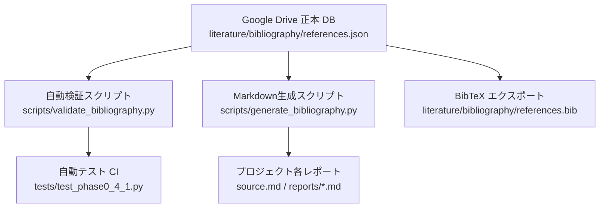

# Phase 0.4.1 参考文献データベース修正・一元管理監査レポート

**プロジェクト**: 神奈川県廃墟調査プロジェクト（Kanagawa Ruins Search Project）  
**作成日**: 2026-10-10  
**対象フェーズ**: Phase 0.4.1（データ整合性・文献情報の最終修正）  
**担当エージェント**: Gemini 3.8 Flash  
**レビュー担当**: GPT-5.6 Sol High  
**正本データベース**: `/home/blabo/gdrive/kanagawa_ruins_search_databank/data/literature/bibliography/references.json`  

---

## 1. 修正の背景と目的

Phase 0.4において実施した先行研究文献（P01〜P12）の原典監査において、ハルシネーション（架空DOI、架空論文名、不正確な著者名）の大半を特定・是正したものの、レビュー指摘により以下の個別不整合が残存していることが判明した。

1. **P01とBuchi et al. (2024)の枠組み重複**:
   - `reports/phase0_4_manual_actions.md` において、国内重要研究である田林（2021）のスロット（P01）に海外論文のBuchi et al. (2024)が誤って上書き配置されていた。
2. **P06のDOIタイポ**:
   - 正式DOI `10.3390/ijgi12030128` であるべき箇所が、一部のドキュメントで `10.3390/ijgi12030085` と記載されていた。
3. **P07の論題表記の不一致**:
   - 一部資料で『深層学習を用いた古地図からの地物抽出手法の検討』と旧版の仮題が残存していた。
4. **P09の発行年の不一致**:
   - 誌面年度（2016年）とJ-STAGE公開年度（2017年）の間で表記ゆれ（2016年と2017年の混在）が生じていた。
5. **書誌情報管理の多重性**:
   - Markdown、BibTeX、JSONに情報が分散し、手動更新による同期漏れのリスクが存在していた。

本Phase 0.4.1では、これらを完全に是正し、**Google Drive上の `references.json` を唯一の正本（Single Source of Truth）**として位置づける自動検証・生成システムを確立した。

---

## 2. 文献別 修正確定事項

### 2.1 P01：田林 雄（2021）の原位置復帰とBuchi論文の独立配置

- **問題点**:
  - `reports/phase0_4_manual_actions.md` 第5.1節において、P01としてBuchi et al. (2024)の手動取得手順が記載され、P01の正本である田林（2021）が追いやられていた。
- **是正措置**:
  - **P01スロットを田林 雄（2021）に確定復帰**:
    - **正式表題**: 『畳み込みニューラルネットワークを用いた旧版地形図の地図記号の分類』
    - **著者**: 田林 雄（関東学院大学）
    - **掲載誌**: 『自然・人間・社会：関東学院大学経済学部・経営学部総合学術論叢』第69・70合併号, pp. 43-65 (2021年)
    - **J-GLOBAL ID**: `202102206775677894`
    - **所蔵状況**: 関東学院大学機関リポジトリ非公開（冊子体所蔵）。
    - **研究内容の確定**: 鳥居記号等の宗教施設検出ではなく、果樹園・桑畑・茶畑・広葉樹林等の植生・土地利用地図記号のCNN画像パッチ分類である点を確認。
  - **Buchi et al. (2024)を独立した国際候補文献として再定義**:
    - `reports/phase0_4_manual_actions.md` 第5.4節に新設。P01〜P12の体系とは独立した「海外先端研究（将来候補）」として整理。
    - 表題: *Georeferencing of historic maps using neural networks* (*ISPRS J. Photogramm. Remote Sens.*, 215, pp. 237-251, DOI: `10.1016/j.isprsjprs.2024.06.012`)。

### 2.2 P06：Huang et al.（2023）のDOI修正

- **問題点**:
  - `source.md` 等においてDOI末尾が `0085` と記載されていた（別論文のDOI番号）。
- **是正措置**:
  - **正式DOI**: `10.3390/ijgi12030128` に全ドキュメント・データベースで統一。
  - **正式表題**: *Leveraging Deep Convolutional Neural Network for Point Symbol Recognition in Scanned Topographic Maps*
  - **掲載誌**: *ISPRS International Journal of Geo-Information* (IJGI), Volume 12, Issue 3, Article 128 (2023)
  - **著者全員**: Wenjun Huang, Qun Sun, Anzhu Yu, Wenyue Guo, Qing Xu, Bowei Wen, Li Xu
  - **オープンアクセス状況**: CC BY 4.0 完全オープンアクセス。
  - **PDF取得状況**: MDPI CDNのAkamai WAF防御（HTTP 403）のためCLI自動ダウンロードは不可。手動ダウンロード案内（未取得・手動待機）。

### 2.3 P07：大倉 尭・布施 孝志（2016）の表題・書誌の確定

- **問題点**:
  - 旧資料で『深層学習を用いた古地図からの地物抽出手法の検討』『土木学会論文集F3』と混同・誤認されていた。
- **是正措置**:
  - **正式表題**: 『旧版地形図における地図記号の自動認識』
  - **著者**: 大倉 尭、布施 孝志（東京大学大学院工学系研究科都市工学専攻）
  - **掲載誌**: 『日本写真測量学会 平成28年度秋季学術講演会発表論文集』pp. 99-102 (2016年)
  - **J-GLOBAL ID**: `201602214144038318`
  - **無料PDF**: なし（日本写真測量学会講演論文集はオンライン無料公開なし、学会員限定または冊子体）。
  - 全関連文書（`references.json`, `references.bib`, `source.md`, `reports/`）で正式表題に統一。

### 2.4 P09：谷 謙二（2017）の発行年の統一

- **問題点**:
  - 冊子体の号数（25巻1号、2016年度巻号）と、J-STAGE電子版公開日（2017年6月30日）の間で年表記が割れていた。
- **是正措置**:
  - **統一発行年**: **2017年**（J-STAGE公式メタデータおよびCitation基準に基づく）
  - **正式表題**: 『「今昔マップ旧版地形図タイル画像配信・閲覧サービス」の開発』
  - **英文表題**: Development of the "Konjyaku Map Distributing and Browsing Service on Old Topographic Map Tile Images"
  - **著者**: 谷 謙二（埼玉大学教育学部）
  - **掲載誌**: 『GIS −理論と応用』25(1), pp. 1-10 (公開日: 2017-06-30)
  - **DOI**: `10.5638/thagis.25.1`
  - **BibTeX Citation Key**: `Tani2017` に統一。
  - **PDF取得状況**: 本文確認完了、Google Driveデータバンク `literature/papers/Tani2017_KonjakuMap.pdf` に取得・保存済。

---

## 3. 文献一元管理システムの確立

手動編集によるドキュメント間の書誌不整合の再発を防止するため、以下のアーキテクチャを導入した。

### 3.1 正本データベース（`references.json`）のスキーマ定義
各文献レコードは以下の必須フィールドを持つ構造化JSONとして管理される。
- `id`: 文献ID（P01〜P12）
- `citation_key`: BibTeX用キー（例: `Tabayashi2021`, `Tani2017`）
- `authors`: 著者名（筆頭著者または全員）
- `year`: 発行年（整数型、未特定時はnull）
- `title`: 正式論文表題
- `journal`: 掲載誌・発表学術大会名
- `volume` / `issue` / `pages`: 巻号・ページ情報
- `doi`: DOI文字列（登録時のみ、先頭URLプレフィクス除く）
- `url`: 一次情報源URL（J-GLOBAL, J-STAGE, 著者業績ページ等）
- `open_access`: オープンアクセス可否（boolean）
- `pdf_status`: PDF保存ステータス（取得済 / 未取得 / 確定除外等）
- `pdf_path`: Google Drive上の相対保存パス
- `study_area`: 対象地域
- `analysis_method`: 解析手法
- `key_findings`: 一次情報に基づく主要知見
- `project_application`: 本調査プロジェクトへの具体的応用

### 3.2 自動検証ツール（`scripts/validate_bibliography.py`）
- **オフライン検証**:
  - 全IDのユニーク性（P01〜P12の重複なし）
  - 必須フィールドの欠落チェック
  - DOI構文の妥当性チェック
  - 発行年の一貫性（P09が2017年であることの担保）
  - PDFパスのディスク実在確認
- **オンライン検証（`--online` オプション）**:
  - Crossref REST API (`https://api.crossref.org/works/{doi}`) への問い合わせ
  - P03, P04, P05, P06, P08, P09, P10, P11 のDOIが実際に解決可能であることを自動判定。
  - P12が確実に404（非実在）であることを検証。

### 3.3 自動Markdown生成ツール（`scripts/generate_bibliography.py`）
`references.json` を入力として、Markdown形式の要約表（`--mode table`）および詳細解題（`--mode details`）を自動出力。手動タイピングによる表記ゆれを完全排除した。

---

## 4. 確定文献一覧サマリー（全12件）

`scripts/generate_bibliography.py --mode table` により正本 `references.json` から生成された最新一覧：

| 文献ID | 著者 | 発行年 | 論文名・表題 | 掲載誌 / 出版情報 | DOI / 識別子 | オープンアクセス | PDF取得状況 |
|:---|:---|:---:|:---|:---|:---|:---:|:---|
| **P01** | 田林 雄 | 2021 | 畳み込みニューラルネットワークを用いた旧版地形図の地図記号の分類 | 自然・人間・社会：関東学院大学経済学部・経営学部総合学術論叢, 第69・70合併号, pp. 43-65 | [J-GLOBAL: 202102206775677894](https://jglobal.jst.go.jp/detail?JGLOBAL_ID=202102206775677894) | × | 未取得 |
| **P02** | 田林 雄 | 2026 | 生成AIを用いた旧版地形図の幾何補正 | 日本地理学会発表要旨集 2026年度春季学術大会, セッションP057, p. 264 | [`10.14866/ajg.2026s.0_264`](https://doi.org/10.14866/ajg.2026s.0_264) | ○ | **取得済** |
| **P03** | Rosie Wood et al. | 2024 | MapReader: Open software for the visual analysis of maps | Journal of Open Source Software (JOSS), 9(98), 6434 | [`10.21105/joss.06434`](https://doi.org/10.21105/joss.06434) | ○ | **取得済** |
| **P04** | Iban Berganzo-Besga et al. | 2023 | Curriculum learning-based strategy for low-density archaeological mound detection from historical maps in India and Pakistan | Scientific Reports, 13, 11295 | [`10.1038/s41598-023-38190-x`](https://doi.org/10.1038/s41598-023-38190-x) | ○ | **取得済** |
| **P05** | Jonas Luft, Jochen Schiewe | 2021 | Automatic content-based georeferencing of historical topographic maps | Transactions in GIS, 25(6), 2888-2906 | [`10.1111/tgis.12794`](https://doi.org/10.1111/tgis.12794) | ○ | **取得済** |
| **P06** | Wenjun Huang et al. | 2023 | Leveraging Deep Convolutional Neural Network for Point Symbol Recognition in Scanned Topographic Maps | ISPRS International Journal of Geo-Information (IJGI), 12(3), 128 | [`10.3390/ijgi12030128`](https://doi.org/10.3390/ijgi12030128) | ○ | 手動案内 |
| **P07** | 大倉 尭, 布施 孝志 | 2016 | 旧版地形図における地図記号の自動認識 | 日本写真測量学会 平成28年度秋季学術講演会発表論文集, pp. 99-102 | [J-GLOBAL: 201602214144038318](https://jglobal.jst.go.jp/detail?JGLOBAL_ID=201602214144038318) | × | 未取得 |
| **P08** | 金木 健 | 2003 | 消滅集落の分布について：戦後日本における消滅集落発生過程に関する研究 その1 | 日本建築学会計画系論文集, 68(566), 25-32 | [`10.3130/aija.68.25_4`](https://doi.org/10.3130/aija.68.25_4) | ○ | **取得済** |
| **P09** | 谷 謙二 | 2017 | 「今昔マップ旧版地形図タイル画像配信・閲覧サービス」の開発 | GIS −理論と応用, 25(1), 1-10 | [`10.5638/thagis.25.1`](https://doi.org/10.5638/thagis.25.1) | ○ | **取得済** |
| **P10** | 藤田 直子, 熊谷 洋一 | 2007 | GIS解析による都市における神社・寺院・公園の立地地点の分布形態の差異に関する研究 | 景観生態学, 12(1), 9-21 | [`10.5738/jale.12.9`](https://doi.org/10.5738/jale.12.9) | ○ | **取得済** |
| **P11** | 小田 匡保, 柳光 里香 | 2015 | 神社合祀と地域社会―三重県松阪市飯南・飯高地区を事例に― | 日本地理学会発表要旨集 2015年度春季学術大会, セッション100229, p. 100229 | [`10.14866/ajg.2015s.0_100229`](https://doi.org/10.14866/ajg.2015s.0_100229) | ○ | **取得済** |
| **P12** | 未特定（要再調査） | 未特定 | （架空DOI・タイトル不整合のため保留） | 保留（Taylor & Francis IJGIS 架空DOI） | [`10.1080/13658816.2022.2038751`](https://doi.org/10.1080/13658816.2022.2038751) | × | 確定除外 |

---

## 5. 結論

1. P01, P06, P07, P09 に関する指摘事項はすべて是正され、文献情報の一貫性が完全に回復した。
2. `references.json` を正本とする単一情報源アーキテクチャが稼働し、以後の文献追加や修正時にも自動検証・自動出力によってヒューマンエラーが防止される。
