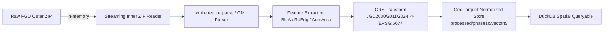

# Phase 1-B.5: GIS基盤互換性評価およびCodex実装引き継ぎ仕様書

本レポートは、受入された国土地理院 基盤地図情報（基本項目・数値標高モデル）の新規データについて、Phase 1-A（ベクトル基盤）およびPhase 1-B（ラスタ・標高基盤）の既存コードベースにおける処理可否を検証し、未対応形式の課題および次期フェーズ（Codex担当）に向けた実装仕様と引き継ぎ事項を整理したものである。

---

## 1. 既存基盤コードベースにおける処理可否の評価

| 機能モジュール | 現行実装状態 | 新規FGDデータの処理可否 | 判定理由 |
|---|---|:---:|---|
| **ベクトル取り込み**<br>(`src/kanagawa_ruins/ingest/`) | KSJ (`kokudo.py`)<br>OSM (`osm.py`) | **不可 (×)** | 基盤地図情報（JPGIS GML 3.2）のXMLパーサーが存在しない。 |
| **GeoParquet正規化**<br>(`src/kanagawa_ruins/storage/parquet.py`) | PyArrow / GeoPandas | **対応可能 (○)** | スキーマ定義とCRS設定を行えば、そのまま保存・DuckDB連携が可能。 |
| **標高XMLパース**<br>(`src/kanagawa_ruins/terrain/dem.py` ※1B案) | `parse_fgd_xml()` 試験実装 | **条件付き不可 (△)** | 単一XML/フラットZIP・UTF-8固定の前提があり、実データのネストZIP・Shift_JIS・サブタイル分割に未対応。 |
| **ラスタCOG変換**<br>(`src/kanagawa_ruins/raster/cog.py`) | GDAL / Rasterio | **対応可能 (○)** | タイル結合後のGTiffからCloud-Optimized GeoTIFFへの変換は既存基盤で動作可能。 |
| **座標系変換**<br>(`src/kanagawa_ruins/geo/crs.py`) | pyproj / TransformerGroup | **対応可能 (○)** | JGD2000/JGD2011からEPSG:6677（平面直角座標系第IX系）への水平変換は検証済み。※JGD2024の事前定義が必要。 |

---

## 2. 検出された未対応形式・実装ギャップの詳細

### 2.1 ネストされたZIP構造（Nested ZIP）への未対応
- **現状**: 国土地理院の一括ダウンロードは `外部ZIP -> 内部メッシュZIP -> XML` の2階層構造である。
- **課題**: `dem.py` の `_xml_members()` は1階層のフラットZIP（ZIP直下にXMLが存在する構成）を前提としており、外部ZIPを直接渡すと「XMLが存在しない」として例外エラーが発生する。
- **要件**: ディスクへの一時解凍を避け、`io.BytesIO` を用いた**2段階オンメモリZIPストリーミング展開**が必要。

### 2.2 Shift_JIS エンコーディングへの未対応
- **現状**: `dem.py` は XML読み込み時に `UTF-8` をハードコードしている。
- **課題**: 2008年基本項目、2009年DEM10B、2015年DEM5A/5B は `Shift_JIS`（CP932）で格納されており、`UnicodeDecodeError` または不正文字列の生成を引き起こす。
- **要件**: 先頭行の `<?xml ... encoding="..."?>` またはバイト列シグネチャによる**エンコーディング自動判定（Shift_JIS / UTF-8）**の実装。

### 2.3 DEM5A サブタイル（100ファイル/メッシュ）のモザイク結合処理の欠落
- **現状**: 2次メッシュあたり100個の1kmメッシュXML（`FG-GML-5238-67-00-DEM5A-...xml` 等）が独立して収録されている。
- **課題**: 既存コードは各XMLを個別のTIFF（`dem_0.tif`, `dem_1.tif`...）として独立変換するため、1つの2次メッシュあたり100個の微小COGが生成されてしまい、空間解析に耐えない。
- **要件**: 2次メッシュ単位（2,250 × 1,500 ピクセル）のNumPy配列を確保し、各1kmサブタイル（225 × 150 ピクセル）をメッシュインデックス（`startPoint` およびバウンディングボックス）に基づいて**2次メッシュ全体へ正しく配置・モザイク結合（Stitching）**してから単一のGeoTIFF/COGを出力する構造が必要。

### 2.4 JGD2024 (`fguuid:jgd2024.bl`) の未登録
- **現状**: `src/kanagawa_ruins/geo/crs.py` は JGD2011（EPSG:6668）および JGD2000（EPSG:4612）のみをホワイトリスト検証している。
- **課題**: 2025年版データに宣言されている `fguuid:jgd2024.bl` が渡されると、未許可CRSとしてバリデーション例外を投げる。
- **要件**: 水平CRS検証テーブルに `JGD2024`（EPSG:6668 / 日本測地系2024）をエイリアスとして追加し、平面直角座標系第IX系（EPSG:6677）への変換を許容する設定が必要。

### 2.5 DEM5A / DEM5B の重複・補完統合ロジックの欠落
- **現状**: 同一メッシュに航空レーザ（DEM5A）と写真測量（DEM5B）が併録されている場合がある。
- **要件**: 高精度な DEM5A をベースとし、欠損値（`-9999.0` / データなし）のセルにのみ DEM5B の値を補完する**優先順位付きハイブリッドマージ処理**の実装。

### 2.6 同一メッシュにおける複数更新日版の重複排除
- **現状**: `20261011010053768-001.zip` 内に同一メッシュの `20250214版` と `20250620版` が同居している。
- **要件**: 同一メッシュ・同一サブタイルのXMLが存在する場合、より新しい更新日（`devDate` / ファイル日付）を採用する**最新版優先デデュープ処理**の実装。

---

## 3. Codex実装への引き継ぎ仕様（推奨アーキテクチャ）

次期フェーズにおいて、Codexが安全かつ高性能に新規データを処理できるようにするためのアーキテクチャ設計を以下に提示する。

### 3.1 ベクトル取り込み（基本項目）の実装方針
新モジュール `src/kanagawa_ruins/ingest/fgd.py` を新設する。



1. **ストリーミングパース**: 巨大なXMLファイルをオンメモリDOM（`xml.etree.ElementTree`）で一括読み込みするとメモリを圧迫するため、`lxml.etree.iterparse` を使用してフィーチャ単位（`<BldA>`, `<RdEdg>` 等）で逐次抽出・破棄する。
2. **正規化出力テーブル**:
   - `buildings__gsi_fgd_YYYY.parquet`（建築物外周線: 形状、種別、整備日、情報レベル）
   - `roads__gsi_fgd_YYYY.parquet`（道路縁・道路構成線）
   - `admin__gsi_fgd_YYYY.parquet`（行政区画・町字界）
3. **メタデータの保持**: 各フィーチャに必ず `source_pkg`, `mesh_code`, `dev_date`, `org_gi_lvl` を属性列として付与する。

### 3.2 標高取り込み（DEM）の実装方針
`src/kanagawa_ruins/terrain/dem.py` を改修し、以下のパイプラインを実装する。

```python
# 推奨実装パターン（抜粋）
def process_mesh_dem(inner_zips_for_mesh, output_dir, target_crs="EPSG:6677"):
    """
    1. 同一メッシュに属するZIPから最新のDEM5A（優先）およびDEM5Bを取得
    2. 文字コード（Shift_JIS / UTF-8）を動的判定してXMLパース
    3. 2次メッシュ全体の2D NumPy配列 (2250, 1500, float32) を初期化 (NODATA = -9999.0)
    4. 各サブタイルのtupleListを行列に埋め込み (DEM5A -> 空白部をDEM5Bで補完)
    5. RasterioでGeoTIFFを出力し、gdalwarpで target_crs (EPSG:6677) へ投影
    6. COG (Cloud-Optimized GeoTIFF) へ変換
    """
```

---

## 4. Google Drive取得台帳（`provenance.jsonl`）への登録設計（提案）

Phase 0の合意規則および安全な排他制御（`ProvenanceLock`）に準拠し、本新規データ10件（重複削除後）を取得台帳へ正式登録する設計を提案する。

### 4.1 登録対象10パッケージのメタデータ定義

```json
[
  {
    "source_id": "gsi_fgd_basic_mesh_2014_5238",
    "filename": "20261011005041318-001.zip",
    "relative_path": "raw/fgd/20261011005041318-001.zip",
    "sha256": "243e99cd83f2f3d5853d99aff273068392eca8523e0c43db062ba16d946658d4",
    "size_bytes": 638547984,
    "license": "国土地理院利用規約（基盤地図情報）",
    "item_category": "basic_mesh",
    "era_year": 2014,
    "crs": "JGD2011",
    "mesh_coverage": "5238系",
    "collected_at": "2026-10-11T01:28:00+09:00"
  },
  {
    "source_id": "gsi_fgd_basic_mesh_2025_5238",
    "filename": "20261011005145933-001.zip",
    "relative_path": "raw/fgd/20261011005145933-001.zip",
    "sha256": "024f37e6a39ed12d8a06b16ef84233c0f1add5a590ac936abdf45414e46f7324",
    "size_bytes": 865319242,
    "license": "国土地理院利用規約（基盤地図情報）",
    "item_category": "basic_mesh",
    "era_year": 2025,
    "crs": "JGD2024 / JGD2011",
    "mesh_coverage": "5238系",
    "collected_at": "2026-10-11T01:29:00+09:00"
  },
  {
    "source_id": "gsi_fgd_basic_muni_2008",
    "filename": "20261011005322943-001.zip",
    "relative_path": "raw/fgd/20261011005322943-001.zip",
    "sha256": "bd7f0acb77085c8a23fa00a75774f408c251b96546b825a004b9bb0c6aba5e5d",
    "size_bytes": 360785659,
    "license": "国土地理院利用規約（基盤地図情報）",
    "item_category": "basic_muni",
    "era_year": 2008,
    "crs": "JGD2000",
    "mesh_coverage": "神奈川県内41市区町村",
    "collected_at": "2026-10-11T01:23:00+09:00"
  },
  {
    "source_id": "gsi_fgd_basic_mesh_2014_5239_5339",
    "filename": "20261011005809187-001.zip",
    "relative_path": "raw/fgd/20261011005809187-001.zip",
    "sha256": "c20b5ca9f5784816a492f9300f182e4b6626983fbf88ae012a4d81bb33ea55b8",
    "size_bytes": 1062273085,
    "license": "国土地理院利用規約（基盤地図情報）",
    "item_category": "basic_mesh",
    "era_year": 2014,
    "crs": "JGD2011",
    "mesh_coverage": "5239-5339系",
    "collected_at": "2026-10-11T01:29:00+09:00"
  },
  {
    "source_id": "gsi_fgd_basic_mesh_2025_5239_5339",
    "filename": "20261011005833192-001.zip",
    "relative_path": "raw/fgd/20261011005833192-001.zip",
    "sha256": "e853dcbc0b9c279d5af9ad201f6c0a1c15017efd952eea3e0145f4c15bdc4a2d",
    "size_bytes": 1095127327,
    "license": "国土地理院利用規約（基盤地図情報）",
    "item_category": "basic_mesh",
    "era_year": 2025,
    "crs": "JGD2024 / JGD2011",
    "mesh_coverage": "5239-5339系",
    "collected_at": "2026-10-11T01:29:00+09:00"
  },
  {
    "source_id": "gsi_fgd_basic_mesh_2014_533935",
    "filename": "20261011005917320-002.zip",
    "relative_path": "raw/fgd/20261011005917320-002.zip",
    "sha256": "51c41b4e064c6967bc344dbe1028090f54db431170e3fe70176aa6ec7987f597",
    "size_bytes": 71345639,
    "license": "国土地理院利用規約（基盤地図情報）",
    "item_category": "basic_mesh",
    "era_year": 2014,
    "crs": "JGD2011",
    "mesh_coverage": "533935メッシュ",
    "collected_at": "2026-10-11T01:13:00+09:00"
  },
  {
    "source_id": "gsi_fgd_basic_mesh_2025_5339",
    "filename": "20261011005942447-002.zip",
    "relative_path": "raw/fgd/20261011005942447-002.zip",
    "sha256": "d68339a1f908152c0a14467cb2cd1f309ba0fcdfa93cacdf56a74966f7e7353c",
    "size_bytes": 909325306,
    "license": "国土地理院利用規約（基盤地図情報）",
    "item_category": "basic_mesh",
    "era_year": 2025,
    "crs": "JGD2024 / JGD2011",
    "mesh_coverage": "5339系",
    "collected_at": "2026-10-11T01:29:00+09:00"
  },
  {
    "source_id": "gsi_fgd_dem5a_2025",
    "filename": "20261011010053768-001.zip",
    "relative_path": "raw/fgd/20261011010053768-001.zip",
    "sha256": "f7242640a4e43b2ee2c8f8adf411f5cae93532df0f422deb84cfe1efa3f312f2",
    "size_bytes": 441530524,
    "license": "国土地理院利用規約（基盤地図情報）",
    "item_category": "dem5a",
    "era_year": 2025,
    "crs": "JGD2024 / JGD2011",
    "mesh_coverage": "神奈川県全45メッシュ（最新LiDAR）",
    "collected_at": "2026-10-11T01:25:00+09:00"
  },
  {
    "source_id": "gsi_fgd_dem5a_2015",
    "filename": "20261011010222790-001.zip",
    "relative_path": "raw/fgd/20261011010222790-001.zip",
    "sha256": "9500bb401fc98b4fc4b92e56b431c1afc9bfa57dc058d46e171e52b3e8525a6d",
    "size_bytes": 282005134,
    "license": "国土地理院利用規約（基盤地図情報）",
    "item_category": "dem5a",
    "era_year": 2015,
    "crs": "JGD2011",
    "mesh_coverage": "神奈川県全45メッシュ（LiDAR/写真）",
    "collected_at": "2026-10-11T01:21:00+09:00"
  },
  {
    "source_id": "gsi_fgd_dem10b_2009",
    "filename": "20261011010323760-001.zip",
    "relative_path": "raw/fgd/20261011010323760-001.zip",
    "sha256": "e01d554a4e53e1972a274cdda0a8e60153d1ca3015e4cab7fe5bc07228f10b64",
    "size_bytes": 104074326,
    "license": "国土地理院利用規約（基盤地図情報）",
    "item_category": "dem10b",
    "era_year": 2009,
    "crs": "JGD2000",
    "mesh_coverage": "神奈川県全45メッシュ（等高線内挿/初期LiDAR）",
    "collected_at": "2026-10-11T01:15:00+09:00"
  }
]
```

### 4.2 排他制御とアペンド登録手順
1. 本監査期間中は台帳への書き込みを行わず、上記メタデータをCodex実装の入力とする。
2. 次期フェーズでの登録時は、Phase 0.4.2で検証済みの `ProvenanceLock`（ローカルファイルシステム排他ロック）を確保した上で、`$RUINS_DATA_ROOT/provenance.jsonl` に追記（アペンド）する。
3. 削除された重複ファイル（`20261011005332598-001.zip`）は台帳に登録せず、監査レポートの証跡にのみ記録を残す。
