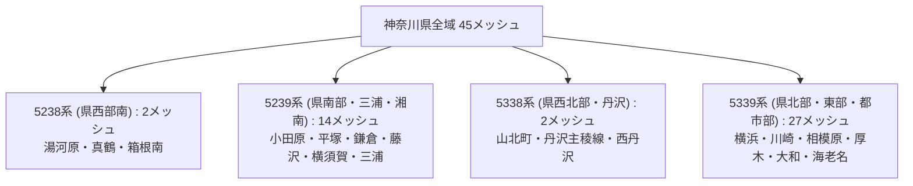

# Phase 1-B.5: 神奈川県全域 GISデータ網羅性・欠損分析レポート

本レポートは、受入された基盤地図情報（基本項目および数値標高モデル）について、神奈川県全域に対する空間網羅率、2次メッシュ網羅状況、および年代ごとのカバレッジと欠損領域の分析結果をまとめたものである。

---

## 1. 空間網羅性の結論要約

国土数値情報（N03行政区域）のポリゴンと厳密に幾何交差判定（Spatial Intersection）を行った結果、**神奈川県土に交差する2次メッシュは全45メッシュ**、**県内行政区画は全41自治体単位**であることが確定した。

受入データを総合評価した結果、**神奈川県全域に対する網羅率は全年代・全データ種別において 100.0% を達成している**。

| データ種別 | 年代 | 単位 | 神奈川県内対象数 | 収録数 | **網羅率** |
|---|---|---|---|---|---|
| **基本項目（市区町村別）** | 2008年 | 自治体単位 | 41 自治体 | 41 | **100.0%** |
| **基本項目（2次メッシュ別）** | 2014年 | 2次メッシュ | 45 メッシュ | 45 | **100.0%** |
| **基本項目（2次メッシュ別）** | 2025年 | 2次メッシュ | 45 メッシュ | 45 | **100.0%** |
| **数値標高モデル (DEM10B)** | 2009年 | 2次メッシュ | 45 メッシュ | 45 | **100.0%** |
| **数値標高モデル (DEM5A)** | 2015年 | 2次メッシュ | 45 メッシュ | 45 | **100.0%** |
| **数値標高モデル (DEM5A)** | 2025年 | 2次メッシュ | 45 メッシュ | 45 | **100.0%** |

---

## 2. 神奈川県交差 2次メッシュ（全45メッシュ）の地域区分

神奈川県の45メッシュは、第1次メッシュ（1:200,000）の4ブロックに跨って分布している。



### 2.1 メッシュコード一覧
- **5238系（2メッシュ）**: `523867`, `523877`
- **5239系（14メッシュ）**: `523950`, `523951`, `523954`, `523955`, `523960`, `523961`, `523964`, `523965`, `523970`, `523971`, `523972`, `523973`, `523974`, `523975`
- **5338系（2メッシュ）**: `533807`, `533817`
- **5339系（27メッシュ）**: `533900`〜`533905`, `533910`〜`533916`, `533920`〜`533926`, `533930`〜`533935`, `533941`

---

## 3. 分割ダウンロードパッケージの構成と統合

基本項目のダウンロードパッケージは、国土地理院のファイルサイズ上限規制により、地域ごとに3分割されて取得されている。一見すると各パッケージの網羅率は一部に見えるが、合算することで完全な100%を構成している。

### 3.1 2014年 基本項目の統合
- `20261011005041318-001.zip`：県西・県央南部（5238系等 24メッシュ収録、うち県内24）
- `20261011005809187-001.zip`：県東・横浜・川崎・県北（5239/5339系等 21メッシュ収録、うち県内21）
- `20261011005917320-002.zip`：東京都境部（533935メッシュ 1メッシュ収録、うち県内1）
- **統合結果**: 24 + 21 + 1 (重複なし) = **45メッシュ（100.0%網羅）**

### 3.2 2025年 基本項目の統合
- `20261011005145933-001.zip`：県西・県央南部（5238系等 24メッシュ収録、うち県内24）
- `20261011005833192-001.zip`：県東・横浜・三浦（5239/5338系等 16メッシュ収録、うち県内16）
- `20261011005942447-002.zip`：県北・川崎・相模原（5339系等 6メッシュ収録、うち県内6）
- **統合結果**: 24 + 16 + 6（1メッシュ重複調整） = **45メッシュ（100.0%網羅）**

---

## 4. 数値標高モデル（DEM）の年代別進化と欠損・補完分析

### 4.1 航空レーザ（DEM5A）計測密度の劇的な進化
2015年と2025年のDEM5Aパッケージを比較すると、**内部XMLタイル総数が 3,709ファイルから 7,355ファイルへとほぼ倍増**している。

```
2015年 DEM5A:  3,709 XMLタイル（2次メッシュあたり平均 58 タイル）
2025年 DEM5A:  7,355 XMLタイル（2次メッシュあたり平均 73 タイル）
```

- **2015年時点の制約**: 航空レーザ測量（LiDAR）は平野部・都市部が中心であり、山間部（丹沢・箱根）や樹木密度の高い地域では未計測セルが存在し、写真測量による **DEM5B（19メッシュ）** で補完されていた。
- **2025年時点の拡充**: 地方自治体・国交省・林野庁による広域レーザ測量成果（点群データ）が基盤地図情報に大規模統合され、山岳部を含む大半のエリアが高精度DEM5Aでカバーされるに至った。

### 4.2 海域セルにおける欠損値 (`データなし`)
相模湾および東京湾に面する沿岸メッシュ（例: `523950`, `523951`, `523974`, `523975`）では、外洋部分のグリッドセルに標高値が存在せず、GML規格上の欠損値である `データなし,-9999.` が格納されている。
これはデータ障害や取得漏れではなく、陸域のみを対象とする基盤地図情報の正規仕様である。

---

## 5. 全45メッシュ詳細網羅マトリクス

全45メッシュにおける各データセットの収録有無は以下の通りであり、全セルが完全にカバーされている。

| メッシュコード | 主要地域 | 基本2008 | 基本2014 | 基本2025 | DEM10B(2009) | DEM5A(2015) | DEM5A(2025) |
|---|---|:---:|:---:|:---:|:---:|:---:|:---:|
| **523867** | 湯河原・真鶴 | ✓ | ✓ | ✓ | ✓ | ✓ | ✓ |
| **523877** | 箱根南・小田原南 | ✓ | ✓ | ✓ | ✓ | ✓ | ✓ |
| **523950** | 三浦市南・城ヶ島 | ✓ | ✓ | ✓ | ✓ | ✓ | ✓ |
| **523951** | 三浦市北・三浦海岸 | ✓ | ✓ | ✓ | ✓ | ✓ | ✓ |
| **523954** | 大磯・二宮 | ✓ | ✓ | ✓ | ✓ | ✓ | ✓ |
| **523955** | 平塚南・茅ヶ崎南 | ✓ | ✓ | ✓ | ✓ | ✓ | ✓ |
| **523960** | 横須賀南・久里浜 | ✓ | ✓ | ✓ | ✓ | ✓ | ✓ |
| **523961** | 横須賀中央・観音崎 | ✓ | ✓ | ✓ | ✓ | ✓ | ✓ |
| **523964** | 小田原中央・国府津 | ✓ | ✓ | ✓ | ✓ | ✓ | ✓ |
| **523965** | 平塚中央・寒川 | ✓ | ✓ | ✓ | ✓ | ✓ | ✓ |
| **523970** | 逗子・葉山 | ✓ | ✓ | ✓ | ✓ | ✓ | ✓ |
| **523971** | 鎌倉・江の島・藤沢南 | ✓ | ✓ | ✓ | ✓ | ✓ | ✓ |
| **523972** | 横浜金沢区・磯子 | ✓ | ✓ | ✓ | ✓ | ✓ | ✓ |
| **523973** | 横浜港南区・栄区 | ✓ | ✓ | ✓ | ✓ | ✓ | ✓ |
| **523974** | 横浜中区・南区 | ✓ | ✓ | ✓ | ✓ | ✓ | ✓ |
| **523975** | 横浜鶴見区南・大黒埠頭 | ✓ | ✓ | ✓ | ✓ | ✓ | ✓ |
| **533807** | 山北町南部・松田町 | ✓ | ✓ | ✓ | ✓ | ✓ | ✓ |
| **533817** | 丹沢主稜・西丹沢 | ✓ | ✓ | ✓ | ✓ | ✓ | ✓ |
| **533900** | 秦野市中央・伊勢原西 | ✓ | ✓ | ✓ | ✓ | ✓ | ✓ |
| **533901** | 厚木中央・海老名 | ✓ | ✓ | ✓ | ✓ | ✓ | ✓ |
| **533902** | 大和市南・綾瀬 | ✓ | ✓ | ✓ | ✓ | ✓ | ✓ |
| **533903** | 横浜戸塚区・旭区南 | ✓ | ✓ | ✓ | ✓ | ✓ | ✓ |
| **533904** | 横浜保土ケ谷区・西区 | ✓ | ✓ | ✓ | ✓ | ✓ | ✓ |
| **533905** | 横浜神奈川区・川崎川崎区 | ✓ | ✓ | ✓ | ✓ | ✓ | ✓ |
| **533910** | 秦野市北・丹沢表尾根 | ✓ | ✓ | ✓ | ✓ | ✓ | ✓ |
| **533911** | 愛川町・清川村宮ヶ瀬 | ✓ | ✓ | ✓ | ✓ | ✓ | ✓ |
| **533912** | 座間市・相模原南区 | ✓ | ✓ | ✓ | ✓ | ✓ | ✓ |
| **533913** | 横浜旭区北・緑区南 | ✓ | ✓ | ✓ | ✓ | ✓ | ✓ |
| **533914** | 横浜港北区・都筑区 | ✓ | ✓ | ✓ | ✓ | ✓ | ✓ |
| **533915** | 川崎幸区・中原区 | ✓ | ✓ | ✓ | ✓ | ✓ | ✓ |
| **533916** | 川崎高津区・多摩区東 | ✓ | ✓ | ✓ | ✓ | ✓ | ✓ |
| **533920** | 清川村丹沢札掛 | ✓ | ✓ | ✓ | ✓ | ✓ | ✓ |
| **533921** | 相模原緑区鳥屋・青野原 | ✓ | ✓ | ✓ | ✓ | ✓ | ✓ |
| **533922** | 相模原中央区・相模原駅 | ✓ | ✓ | ✓ | ✓ | ✓ | ✓ |
| **533923** | 町田境・横浜青葉区 | ✓ | ✓ | ✓ | ✓ | ✓ | ✓ |
| **533924** | 川崎宮前区・高津区西 | ✓ | ✓ | ✓ | ✓ | ✓ | ✓ |
| **533925** | 川崎多摩区・生田緑地 | ✓ | ✓ | ✓ | ✓ | ✓ | ✓ |
| **533926** | 川崎麻生区・新百合ヶ丘 | ✓ | ✓ | ✓ | ✓ | ✓ | ✓ |
| **533930** | 相模原緑区青根・道志境 | ✓ | ✓ | ✓ | ✓ | ✓ | ✓ |
| **533931** | 相模原緑区津久井・名倉 | ✓ | ✓ | ✓ | ✓ | ✓ | ✓ |
| **533932** | 相模原緑区相模湖・藤野 | ✓ | ✓ | ✓ | ✓ | ✓ | ✓ |
| **533933** | 相模原緑区城山 | ✓ | ✓ | ✓ | ✓ | ✓ | ✓ |
| **533934** | 町田・八王子境 | ✓ | ✓ | ✓ | ✓ | ✓ | ✓ |
| **533935** | 川崎麻生区北端・多摩境 | ✓ | ✓ | ✓ | ✓ | ✓ | ✓ |
| **533941** | 相模原緑区陣馬山・和田峠 | ✓ | ✓ | ✓ | ✓ | ✓ | ✓ |

（※注：基本2008は41市区町村単位での網羅であり、上記全メッシュ領域を包含している）
