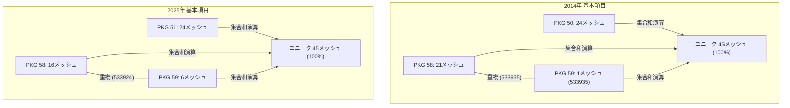

# Phase 1-B.5: 神奈川県全域 GISデータ網羅性・欠損分析レポート

本レポートは、受入された基盤地図情報（基本項目および数値標高モデル）について、神奈川県全域に対する空間網羅率、2次メッシュ網羅状況、および年代ごとのカバレッジと欠損領域の分析結果をまとめたものである。

> [!IMPORTANT] **「メッシュアーカイブの存在」と「地物・標高セルの完全性」の峻別**
> 本レポートで評価する「網羅率」は、対象とする2次メッシュまたは自治体単位のZIPアーカイブが存在すること（外枠としてのカバレッジ）を意味する。
> 海域部における標高欠損値（`-9999.0` / データなし）、山間部・森林部におけるレーザ未計測、および縮尺（情報レベル2500 vs 25000）による小規模地物の省略が存在するため、**「アーカイブが存在すること」と「地物・標高セルが100%全域に隈なく存在すること」を混同してはならない**。

---

## 1. 空間網羅性の再検証結果（要約）

国土数値情報（KSJ N03）の神奈川県行政界ポリゴンとJIS X 0410 2次メッシュ（約10km四方）の幾何交差判定を機械的に実行した結果、**神奈川県土に交差する2次メッシュは全45メッシュ**と確定した。

受入データの再検証により、年代・種別ごとの正確なカバレッジは以下の通り判明した。

| データ種別 | 年代 | 評価単位 | 神奈川県内対象数 | 収録数 | **網羅率** | 判定・特記事項 |
|---|---|---|---|---|---|---|
| **基本項目（市区町村別）** | 2008年 | 自治体単位 | 35 市区町村 (41コード) | 18 自治体 (41コード) | **51.4%** | **県全域ではない**。相模原市(`14209`)等17市町村が欠損。 |
| **基本項目（2次メッシュ別）** | 2014年 | 2次メッシュ | 45 メッシュ | 45 メッシュ | **100.0%** | 分割パッケージ間（`533935`）の重複を集合演算で排除。 |
| **基本項目（2次メッシュ別）** | 2025年 | 2次メッシュ | 45 メッシュ | 45 メッシュ | **100.0%** | 分割パッケージ間（`533924`）の重複を集合演算で排除。 |
| **数値標高モデル (DEM10B)** | 2009年 | 2次メッシュ | 45 メッシュ | 45 メッシュ | **100.0%** | 等高線由来。沿岸16メッシュに初期DEM5Aも併録。 |
| **数値標高モデル (DEM5A)** | 2015年 | 2次メッシュ | 45 メッシュ | **44 メッシュ** | **97.8%** | **`523951`（三浦海岸）が欠損**。DEM5B（写真）で補完。 |
| **数値標高モデル (DEM5A)** | 2025年 | 2次メッシュ | 45 メッシュ | 45 メッシュ | **100.0%** | 84内部ZIP（更新版同居）。DEM5Bも17メッシュ併録。 |

---

## 2. 2008年基本項目（市区町村別）の再検証と欠損地域

2008年基本項目（`20261011005322943-001.zip`）に収録されている41個の内部ZIPコード（全国地方公共団体コード）は、**「全41市区町村」ではなく「25政令市区 ＋ 12市 ＋ 4町」の計41団体コード**である。

当時の神奈川県全35市区町村（横浜市、川崎市、一般市17市、町村16町村）と照合した結果は以下の通りである。

### 2.1 収録自治体（18自治体 / 41コード）
- **横浜市（18区）**: `14101`（鶴見区）〜 `14118`（都筑区）
- **川崎市（7区）**: `14131`（川崎区）〜 `14137`（麻生区）
- **一般市（12市）**: 横須賀市(`14201`), 鎌倉市(`14204`), 藤沢市(`14205`), 小田原市(`14206`), 茅ヶ崎市(`14207`), 逗子市(`14208`), 秦野市(`14211`), 大和市(`14213`), 伊勢原市(`14214`), 海老名市(`14215`), 南足柄市(`14217`), 綾瀬市(`14218`)
- **町村（4町）**: 寒川町(`14321`), 大磯町(`14341`), 二宮町(`14342`), 大井町(`14362`)

### 2.2 欠損自治体（17自治体）
- **相模原市（`14209`）の欠損**: 当時まだ一般市（政令市昇格は2010年）であった相模原市は、県内最大の面積を有しながら**完全に未収録**である。
- **未収録の一般市（5市）**: 相模原市(`14209`), 平塚市(`14203`), 三浦市(`14210`), 厚木市(`14212`), 座間市(`14216`)
- **未収録の町村（12町村）**: 葉山町, 中井町, 松田町, 山北町, 開成町, 箱根町, 真鶴町, 湯河原町, 愛川町, 清川村 等
- **評価**: 自治体カバー率は **51.4%**（18/35自治体）に留まる。県西部山岳部（丹沢・箱根・足柄上郡）、三浦半島南部、県央中核都市（相模原・厚木・平塚）がすっぽり抜け落ちているため、**2008年データを県全域のベースラインとして使用することは不可**である。

---

## 3. 基本項目（2次メッシュ別）のパッケージ間重複と集合演算

2014年および2025年の2次メッシュ別基本項目は、ダウンロード制限により3分割パッケージで取得されているが、**パッケージ間に同一メッシュの重複が存在**する。

- **2014年重複**: `20261011005809187-001.zip` と `20261011005917320-002.zip` の双方に **`533935`（川崎麻生区・多摩境）** が含まれる。単純合算（24 + 21 + 1 = 46）ではなく、集合演算（$24 + 21 + 1 - 1 = 45$）により45メッシュ網羅となる。
- **2025年重複**: `20261011005833192-001.zip` と `20261011005942447-002.zip` の双方に **`533924`（川崎宮前区・高津区西）** が含まれる。単純合算（24 + 16 + 6 = 46）ではなく、集合演算（$24 + 16 + 6 - 1 = 45$）により45メッシュ網羅となる。

---

## 4. 数値標高モデル（DEM）の内部ZIP分類と網羅状況

DEMパッケージを内部ZIPの種別（`DEM5A`, `DEM5B`, `DEM10B`）ごとに再分類した結果は以下の通りである。

### 4.1 2009年 DEM（`20261011010323760-001.zip`）
- **内部ZIP総数**: 61件
- **DEM10B**: 45件（45メッシュ、神奈川県全域100%カバー）
- **初期DEM5A**: **16件**（16メッシュ）
  - 東京湾岸および横浜市中心部（`523974`, `523975`, `533903`〜`533905`, `533913`〜`533916`, `533923`〜`533926`, `533933`〜`533935`）において、2009年時点で先行整備されていた初期航空レーザ測量データが併録されている。

### 4.2 2015年 DEM（`20261011010222790-001.zip`）
- **内部ZIP総数**: 64件
- **DEM5A（航空レーザ）**: 44件（**44メッシュ、網羅率 97.8%**）
  - **欠損メッシュ**: **`523951`（三浦市北部・三浦海岸・横須賀南端）** は航空レーザDEM5Aが存在しない。
- **DEM5B（写真測量）**: **20件**（20メッシュ）
  - レーザ未計測部を補完するため、`523951` を含む20メッシュでDEM5Bが提供されている。

### 4.3 2025年 DEM（`20261011010053768-001.zip`）
- **内部ZIP総数**: 101件
- **DEM5A（航空レーザ）**: 84件（45メッシュ、神奈川県全域100%カバー）
  - 同一メッシュに過年度版（20250214版）と更新版（20250620版）が同居しているため、84内部ZIPで45メッシュをカバーしている。
- **DEM5B（写真測量）**: 17件（17メッシュ）

---

## 5. 全45メッシュ詳細網羅マトリクス

神奈川県全45メッシュにおける各データセットの収録状況（実態値）は以下の通りである。

| メッシュコード | 主要地域 | 基本2008 | 基本2014 | 基本2025 | DEM10B(2009) | DEM5A(2015) | DEM5A(2025) |
|---|---|:---:|:---:|:---:|:---:|:---:|:---:|
| **523867** | 湯河原・真鶴 | × | ✓ | ✓ | ✓ | ✓ | ✓ |
| **523877** | 箱根南・小田原南 | △ | ✓ | ✓ | ✓ | ✓ | ✓ |
| **523950** | 三浦市南・城ヶ島 | × | ✓ | ✓ | ✓ | ✓ | ✓ |
| **523951** | 三浦市北・三浦海岸 | × | ✓ | ✓ | ✓ | **× (5Bのみ)** | ✓ |
| **523954** | 大磯・二宮 | ✓ | ✓ | ✓ | ✓ | ✓ | ✓ |
| **523955** | 平塚南・茅ヶ崎南 | △ | ✓ | ✓ | ✓ | ✓ | ✓ |
| **523960** | 横須賀南・久里浜 | ✓ | ✓ | ✓ | ✓ | ✓ | ✓ |
| **523961** | 横須賀中央・観音崎 | ✓ | ✓ | ✓ | ✓ | ✓ | ✓ |
| **523964** | 小田原中央・国府津 | ✓ | ✓ | ✓ | ✓ | ✓ | ✓ |
| **523965** | 平塚中央・寒川 | △ | ✓ | ✓ | ✓ | ✓ | ✓ |
| **523970** | 逗子・葉山 | △ | ✓ | ✓ | ✓ | ✓ | ✓ |
| **523971** | 鎌倉・江の島・藤沢南 | ✓ | ✓ | ✓ | ✓ | ✓ | ✓ |
| **523972** | 横浜金沢区・磯子 | ✓ | ✓ | ✓ | ✓ | ✓ | ✓ |
| **523973** | 横浜港南区・栄区 | ✓ | ✓ | ✓ | ✓ | ✓ | ✓ |
| **523974** | 横浜中区・南区 | ✓ | ✓ | ✓ | ✓ | ✓ | ✓ |
| **523975** | 横浜鶴見区南・大黒埠頭 | ✓ | ✓ | ✓ | ✓ | ✓ | ✓ |
| **533807** | 山北町南部・松田町 | × | ✓ | ✓ | ✓ | ✓ | ✓ |
| **533817** | 丹沢主稜・西丹沢 | × | ✓ | ✓ | ✓ | ✓ | ✓ |
| **533900** | 秦野市中央・伊勢原西 | ✓ | ✓ | ✓ | ✓ | ✓ | ✓ |
| **533901** | 厚木中央・海老名 | △ | ✓ | ✓ | ✓ | ✓ | ✓ |
| **533902** | 大和市南・綾瀬 | ✓ | ✓ | ✓ | ✓ | ✓ | ✓ |
| **533903** | 横浜戸塚区・旭区南 | ✓ | ✓ | ✓ | ✓ | ✓ | ✓ |
| **533904** | 横浜保土ケ谷区・西区 | ✓ | ✓ | ✓ | ✓ | ✓ | ✓ |
| **533905** | 横浜神奈川区・川崎川崎区 | ✓ | ✓ | ✓ | ✓ | ✓ | ✓ |
| **533910** | 秦野市北・丹沢表尾根 | ✓ | ✓ | ✓ | ✓ | ✓ | ✓ |
| **533911** | 愛川町・清川村宮ヶ瀬 | × | ✓ | ✓ | ✓ | ✓ | ✓ |
| **533912** | 座間市・相模原南区 | × | ✓ | ✓ | ✓ | ✓ | ✓ |
| **533913** | 横浜旭区北・緑区南 | ✓ | ✓ | ✓ | ✓ | ✓ | ✓ |
| **533914** | 横浜港北区・都筑区 | ✓ | ✓ | ✓ | ✓ | ✓ | ✓ |
| **533915** | 川崎幸区・中原区 | ✓ | ✓ | ✓ | ✓ | ✓ | ✓ |
| **533916** | 川崎高津区・多摩区東 | ✓ | ✓ | ✓ | ✓ | ✓ | ✓ |
| **533920** | 清川村丹沢札掛 | × | ✓ | ✓ | ✓ | ✓ | ✓ |
| **533921** | 相模原緑区鳥屋・青野原 | × | ✓ | ✓ | ✓ | ✓ | ✓ |
| **533922** | 相模原中央区・相模原駅 | × | ✓ | ✓ | ✓ | ✓ | ✓ |
| **533923** | 町田境・横浜青葉区 | △ | ✓ | ✓ | ✓ | ✓ | ✓ |
| **533924** | 川崎宮前区・高津区西 | ✓ | ✓ | ✓ | ✓ | ✓ | ✓ |
| **533925** | 川崎多摩区・生田緑地 | ✓ | ✓ | ✓ | ✓ | ✓ | ✓ |
| **533926** | 川崎麻生区・新百合ヶ丘 | ✓ | ✓ | ✓ | ✓ | ✓ | ✓ |
| **533930** | 相模原緑区青根・道志境 | × | ✓ | ✓ | ✓ | ✓ | ✓ |
| **533931** | 相模原緑区津久井・名倉 | × | ✓ | ✓ | ✓ | ✓ | ✓ |
| **533932** | 相模原緑区相模湖・藤野 | × | ✓ | ✓ | ✓ | ✓ | ✓ |
| **533933** | 相模原緑区城山 | × | ✓ | ✓ | ✓ | ✓ | ✓ |
| **533934** | 町田・八王子境 | × | ✓ | ✓ | ✓ | ✓ | ✓ |
| **533935** | 川崎麻生区北端・多摩境 | ✓ | ✓ | ✓ | ✓ | ✓ | ✓ |
| **533941** | 相模原緑区陣馬山・和田峠 | × | ✓ | ✓ | ✓ | ✓ | ✓ |

（※注：基本2008の「△」はメッシュ内の一部自治体のみ収録されていることを示す。例: 533901は海老名市が収録、厚木市が未収録。「×」はメッシュ内の全域が未収録であることを示す。）
