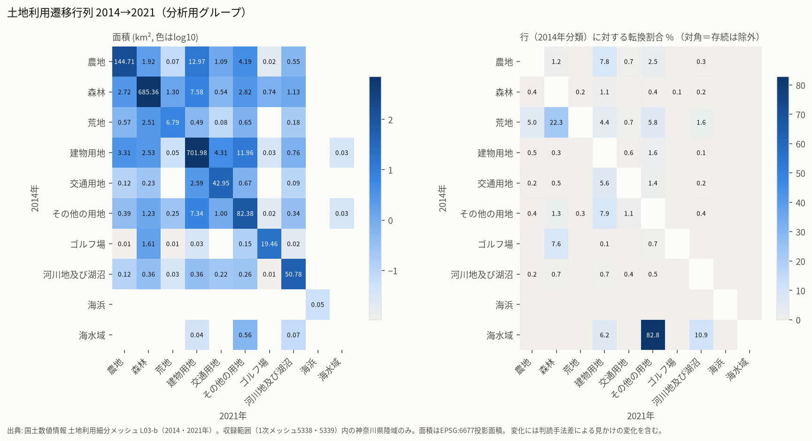

# Phase 1-C2 土地利用変化分析（2014→2021年）主報告

- 担当: Claude（Codexの建物・道路時系列分析とは独立して実施）
- ブランチ: `claude/phase1c2-landuse-historical-analysis`
- 分析版: `phase1c2-claude-0.1.0`（Drive公開時のコード: commit `1424e5a`）
- 派生データ: `$RUINS_DATA_ROOT/processed/phase1c/claude/phase1c2-claude-0.1.0/`（54ファイル。`run_manifest.json` SHA-256 `ccbaae87b21aca3715ba44c81266e4a3dc146f061ccc46aeb16563f8344f5a64`）
- 関連報告: [遷移行列](phase1c2_transition_matrix.md) / [地域別分析](phase1c2_regional_analysis.md) / [歴史地理学的解釈](phase1c2_historical_interpretation.md) / [データの制約](phase1c2_data_limitations.md) / [地形解析の拡張設計](../docs/phase1c2_terrain_extension.md)

本報告は記述的な分析である。廃墟・廃村・廃神社の存否判定、候補の抽出・ランキング、個別地点の公表は行っていない。

## 0. 要点

1. **解析できる範囲は県土の75.3%（1,818 km²／2,416 km²）に限られる。** 土地利用細分メッシュは1次メッシュ5338・5339（北緯35°20′以北）しか取得されていない。横須賀・三浦・逗子・葉山・小田原・箱根・真鶴・湯河原・二宮・大磯は収録外（大磯は0.6%）、鎌倉・南足柄・茅ヶ崎・中井・大井・開成は一部のみである。結果を県全域に外挿しない。
2. 2014年と2021年は、同じ127の2次メッシュ・1,270,000セルを同じメッシュコードで収録している。同一コードのセル重心の差は最大0.02 mmで、同じ場所のセル同士を比較している。
3. 収録範囲内の陸域1,817.7 km²のうち、分析用グループが変化した面積は4.58%（83.2 km²）である。そのうち **82%は単独セルの変化**（66.9%は変化先の分類が2014年に既に隣接していた「境界の変化」、15.4%は「内部の単独変化」）で、隣接2セル以上が同じ遷移をした「まとまった変化」は17.6%にとどまる。
4. 国土数値情報の公式ページには「2021年度は従来より高解像度の衛星画像を用いたため、2016年度以前と判読が多く異なる」という注意がある。2014→2021の差には、判読手法の差による見かけの変化が相当量含まれると考えられる。
5. 純変化（2014→2021）: 農地 −13.6 km²（−8.2%）、森林 −6.5 km²（−0.9%）、荒地 −2.8 km²（−24.5%）、建物用地 +8.4 km²（+1.2%）、交通用地 +3.5 km²（+7.6%）、その他の用地 +10.7 km²（+11.5%）。
6. 重点的に見た「衰退に似た遷移」（建物用地→森林・荒地、農地→森林・荒地）は、**4種類すべてで逆向きの遷移の方が面積が大きい**。例として、建物用地→森林は2.53 km²、森林→建物用地は7.58 km²である。また建物用地→森林のセルのうちパッチに属するのは1.2%だけである。
7. 森林卓越メッシュでは建物用地の総減少率が10.3%と高い一方、純変化は−0.55%である。基数が小さく（建物用地5.8 km²）、増減が大きく相殺されている。
8. 「駅から遠いほど建物用地の減少率が高い」という全体の傾向は、主に土地被覆構成の違いで説明される。都市的メッシュ内での距離勾配は小さい。
9. 実DEMの派生物が未整備のため、地形解析は未実施である。1976年はTokyo Datumのため、属性集計のみ行った。

## 1. 使用データと前処理

すべてPhase 1-Aで作成したGeoParquetを読み取り専用で使用した。各入力は読み込み時にSHA-256を再計算し、Phase 1-Aのmanifestの`output_sha256`と照合した（一覧は[データの制約 §8](phase1c2_data_limitations.md#8-入力の出典とsha-256)）。

| データ | 年次 | 用途 | 座標系 |
|---|---|---|---|
| 土地利用細分メッシュ L03-b（5338・5339） | 2014, 2021 | 遷移分析 | 元 JGD2000 / JGD2011 → EPSG:6677 |
| 同上 | 1976 | 属性集計のみ | EPSG:4301（Tokyo Datum）のまま |
| 行政区域 N03 神奈川 | 2026-01-01 | 市区町村への割当・網羅率 | EPSG:6677 |
| CODH 旧行政区域（城山・津久井・相模湖・藤野） | 2005-01-01（津久井は1955も） | 旧津久井郡の範囲 | EPSG:6677 |
| 鉄道 N02（区間・駅） | 2023 | 距離 | EPSG:6677 |
| 河川 W05 神奈川 | 2008 | 距離（セル属性のみ） | EPSG:6677 |
| 文化財 P32 神奈川 | 2014-01-31時点 | 周辺の土地利用 | EPSG:6677 |
| OSM 道路・宗教施設・historic（津久井周辺の抽出20レイヤー） | 2026-10 | 津久井周辺での距離・周辺の土地利用 | EPSG:6677 |

## 2. 検証（少数メッシュから全体へ）

1. **少数メッシュでの試行**: 2次メッシュ533931（津久井）と533914（横浜港北）の2万セルで全工程を実行した。1 kmメッシュ53393145・53391477について、原本Parquetから別のコードで遷移と率を手計算し、集計値と完全に一致することを確認した（例: 陸域1.046909 km²、農地総減少率0.0909085）。
2. **メッシュの対応付け**: 2014年と2021年のメッシュコード集合は一致した（各1,270,000）。同一コードのセル重心の差は最大1.85×10⁻⁵ m、ポリゴンの対称差は最大0.008 m²だった。メッシュコードから復号したセル中心とジオメトリ重心の差は最大0.1 mmである。
3. **分類コード**: 2014・2021年とも、観測されたのは公式コード表LandUseCd-09の12コードのみで、未知コードはない。両年の公式表は同一である。1976年は公式LandUseCd-77の15コードのみだった。
4. **面積**: EPSG:6677の投影面積と、GRS80楕円体上の測地面積の差はセルあたり最大0.048%、収録範囲の神奈川県陸域合計で0.014%（1,817.71 vs 1,817.97 km²）。面積はすべてセルの投影面積の合計で計算し、セル数を面積とみなしていない。
5. **市区町村への割当**: セル重心のpoint-in-polygonで割り当てた。重複割当はない。セル面積の合計は、市区町村ポリゴンと収録範囲の交差面積と0.01%以内で一致した（1,818.26 vs 1,818.40 km²）。
6. **別の方法による照合（DuckDB Spatial）**: 原本Parquetを読み直し、メッシュコード結合、`ST_Area`、`ST_Within`による独自の空間結合で再計算した。遷移行列の差は最大3×10⁻¹² km²、市区町村別陸域面積の差は最大8×10⁻¹³ km²、セル数の差は0、無作為500セルの鉄道距離の差は最大7×10⁻¹² mで、すべて一致した（`qa/crosscheck.json`）。
7. **重複地物**: 土地利用のメッシュコード重複はない。OSMは複数の抽出間で重複していたため、`(osm_type, osm_id)`で除去した（道路3,515件、宗教施設18件、historic 35件）。P32は県版と全国版14が同一の336件であることを確認し、県版のみを使った。同一座標の重複が115件あるため、地点単位に集約した。
8. **テスト**: 合成データの回帰テスト27件（`tests/test_phase1c2_synthetic.py`）と、実データの統合テスト4件（`RUINS_RUN_LIVE=1 tests/test_phase1c2_live.py`）はすべて合格した。

## 3. 分析方法の要点

- **分析用グループ**: 田とその他の農用地を「農地」、道路と鉄道を「交通用地」にまとめた（`codes.py`）。年次間の公式な対応関係を示すものではない。
- **見かけの変化の区別**: 各変化セルについて、8近傍で同じ遷移をしたセルの数と、変化先の分類が2014年に既に隣接していたかを記録した。分類は「patch（同じ遷移が2セル以上隣接）」「isolated_boundary」「isolated_interior」の3つ。単独セルの変化や境界上の変化は、100 mセルの優占分類の入れ替わりや判読差で生じやすい。ただし、実際の小規模な変化である可能性も否定しない。
- **増減の分解**: Pontiusらの方法で、総増加・総減少・純変化・swap（他所での逆向きの変化と相殺される量）に分解した。
- **2014年土地被覆類型（1 kmメッシュ）**: 森林≥70%を「森林卓越」、建物用地＋交通用地≥50%を「都市的」、農地≥20%を「農地混在」、それ以外を「その他混在」とした。地形区分ではない。
- **統計**: 1 kmメッシュの各指標についてMoran's I（queen近傍・行標準化・999回の並べ替え検定）を計算した。正の空間自己相関が有意だったため、距離帯別の率は約5 kmの空間ブロック（50×50セル）を単位としたブロック・ブートストラップ（999回）で95%区間を示した。独立観測を仮定した検定は使っていない。

## 4. 主な結果

詳細は各報告を参照。

### 4.1 構成の変化（収録範囲の神奈川県陸域、km²）

| グループ | 2014 | 2021 | 純変化 | 純変化率 | 総減少 | 総増加 | swap/総変化 |
|---|---:|---:|---:|---:|---:|---:|---:|
| 農地 | 165.52 | 151.93 | −13.58 | −8.2% | 20.80 | 7.22 | 0.52 |
| 森林 | 702.19 | 695.74 | −6.45 | −0.9% | 16.83 | 10.38 | 0.76 |
| 荒地 | 11.27 | 8.51 | −2.76 | −24.5% | 4.48 | 1.72 | 0.55 |
| 建物用地 | 724.95 | 733.38 | +8.43 | +1.2% | 22.97 | 31.41 | 0.84 |
| 交通用地 | 46.65 | 50.19 | +3.53 | +7.6% | 3.70 | 7.24 | 0.68 |
| その他の用地 | 92.98 | 103.64 | +10.66 | +11.5% | 10.59 | 21.25 | 0.67 |
| ゴルフ場 | 21.29 | 20.29 | −1.01 | −4.7% | 1.84 | 0.83 | 0.62 |
| 河川地及び湖沼 | 52.13 | 53.92 | +1.78 | +3.4% | 1.35 | 3.14 | 0.60 |

細分類では、道路（0901）が+14.0%（31.47→35.87 km²）、田が−7.2%、その他の農用地が−8.6%だった。道路の増加には、高解像度画像で細い道路を面として捉えやすくなった影響が含まれる可能性がある。

### 4.2 遷移



面積の大きい遷移（km²、括弧内はpatchの割合）: 農地→建物用地 12.97（14%）、建物用地→その他の用地 11.96（29%）、森林→建物用地 7.58（3%）、その他の用地→建物用地 7.34（21%）、建物用地→交通用地 4.31（7%）、農地→その他の用地 4.19（45%）。

### 4.3 集落縮小に関係しうる遷移（観測値）

| 遷移 | 面積 km² | 2014年の基分類に対する率 | patch | 境界単独 | 内部単独 | 逆向き km² |
|---|---:|---:|---:|---:|---:|---:|
| 建物用地→森林 | 2.53 | 0.35% | 1.2% | 87.6% | 11.2% | 7.58 |
| 建物用地→荒地 | 0.05 | 0.01% | 0% | 100% | 0% | 0.49 |
| 農地→森林 | 1.92 | 1.16% | 6.6% | 84.7% | 8.7% | 2.72 |
| 農地→荒地 | 0.07 | 0.04% | 0% | 42.9% | 57.1% | 0.57 |

建物用地→非建物用地のセルは8近傍で1,523群に分かれる。1,176群は単独セルで、10セル以上の群は6つしかない。5セル以上の群の転換先は、ほぼすべて都市的メッシュでの「その他の用地」（人工造成地の空地を含む区分）または交通用地だった。

建物用地の連続的な縮小については、空間的にまとめて比較できる時点が2014年と2021年の2時点しかないため、時間的な連続性は評価できない。

### 4.4 地域・交通・宗教施設

- 地域別では、旧津久井郡4町（農地→森林 2.41%、森林化率 3.86%、建物用地→森林・荒地 1.78%）と県西の収録部分（建物用地の総減少率 7.20%、建物用地→森林・荒地 2.29%）で、山地的な遷移の率が高い。ただし面積はそれぞれ0.3 km²前後と小さく、建物用地の純変化はそれぞれ+4.25%と−0.25%である（[地域別分析](phase1c2_regional_analysis.md)）。
- 交通: 全セルでは駅から2〜8 kmの距離帯で建物用地の総減少率が4.7〜5.0%と高く、0〜500 mでは2.4%である。都市的メッシュに限ると2.2%（0〜500 m）から3.1%（2〜4 km）で、勾配は小さい。距離帯間の差の多くは、遠方ほど森林卓越地が多いという構成の差によるものと考えられる。
- P32の108地点（250 m圏）は、同じ地域の平均に比べて建物用地の割合が高く（53% vs 45%）、森林の割合が低い（27% vs 32%）。天然記念物を含む地点では森林が42%である。OSMの宗教施設21件（津久井周辺のみ）は、車道から中央値21 mの位置にある。

## 5. 最終報告

### 5.1 実際に確認された土地利用変化
- 収録範囲の陸域の4.6%で分類が変化した。農地は8.2%の純減で、純減の大部分は建物用地（12.97 km²）とその他の用地（4.19 km²）への転換である。森林・荒地への転換は合計2.0 km²だった。
- 建物用地は1.2%の純増、その他の用地は11.5%の純増だった。建物用地の減少分の主な転換先は、その他の用地（11.96 km²）と交通用地（4.31 km²）である。
- 荒地は24.5%の純減で、主な転換先は森林（2.51 km²、patch 36%）だった。
- 変化の82%は単独セルの変化であり、判読手法の差と見分けられない。

### 5.2 地域別の変化の違い
- 横浜・川崎、相模原、県央では農地の純減率が10〜13%と大きく、主な転換先は建物用地とその他の用地である。
- 湘南の収録部分は、農地の割合が20.7%と高い。農地の純減は7.7%、建物用地の純増は3.0%だった。
- 旧津久井郡4町と県西の収録部分は森林が80%以上を占める。変化した面積の割合は2%と小さいが、森林化率（約3.9%）と建物用地→森林・荒地の率が高い。三浦半島は収録7%のため比較から除外し、県西の結果は主に山北町・松田町を表す。

### 5.3 交通網との空間的関係
- 2014年の「道路」セルからの距離で見ると、都市的メッシュでは建物用地の総減少率は2.4〜3.0%でほぼ一定だった。森林卓越メッシュでは1.6 km以上の距離帯で12.1%［95%区間 5.6–17.6］と高いが、基数は3.7 km²しかない。
- 鉄道（2023年）・駅からの距離との関係も同じ傾向で、層別すると勾配は小さくなる。
- OSM（2026年）の道路は津久井周辺の窓（9,662セル）でのみ使用した。建物用地はほぼすべて車道から100 m以内にあり、100 mを超える距離帯は基数が小さすぎて比較できない。「交通網から遠い地域ほど衰退している」という結論は、このデータからは支持されない。

### 5.4 神社・文化財との空間的関係
- P32の周辺（250 m・500 m）では、同じ地域の平均と比べて建物用地の割合が高い。変化率（建物用地の総減少率2.5%、農地→森林3.2%）は小面積に基づくため、地域平均との差を有意とは扱えない。
- OSMの宗教施設は、津久井周辺の平均（森林81%）に比べて森林の割合が低く（54%）、車道に近い。OSMの登録の偏り（道路近くの建物が登録されやすい）も原因となりうる。
- OSMに登録がないことから廃絶を推論することはしない（[データの制約 §5](phase1c2_data_limitations.md#5-osmとp32の制約)）。

### 5.5 集落変化について考えられる仮説（検証前の仮説）
[歴史地理学的解釈 §3](phase1c2_historical_interpretation.md#3-仮説データから導けることと導けないこと)に、H1〜H5として観測値と分けて記載した。

### 5.6 データだけでは判断できない事項
建物用地→森林の個々のセルが実際の家屋の消失かどうか、農地の森林化が耕作放棄・植林・分類変更のいずれによるか、変化の時期（2014〜2021年のどこか）、2014年以前（1976年からの空間的変化）、OSMにない社寺の現況。いずれもこのデータだけでは判断できない。

### 5.7 DEMによって追加検証すべき事項
標高・傾斜・谷/尾根（TPI）と遷移率の関係、山間の建物用地の立地条件、道路距離と傾斜の関係（[拡張設計](../docs/phase1c2_terrain_extension.md)）。今回は**未実施**。

### 5.8 今後の歴史資料との照合方針
[歴史地理学的解釈 §5](phase1c2_historical_interpretation.md#5-今後の歴史資料との照合方針)を参照。測地変換を検証した後の1976年との空間比較、旧版地形図・空中写真の位置合わせ、地誌・神社明細帳との照合を、公開前の審査を含めて段階的に行う。

## 6. 再現方法

```bash
conda activate kanagawa-ruins
python -m pytest tests/test_phase1c2_synthetic.py -q
python scripts/phase1c2_analyze.py --sample-mesh2 533931 --sample-mesh2 533914 --work-dir <scratch>   # 少数メッシュ検証
python scripts/phase1c2_analyze.py --work-dir <scratch>                                             # 全体（Driveへの書き込みなし）
python scripts/phase1c2_analyze.py --execute                                                        # Driveへの公開（上書き禁止）
RUINS_RUN_LIVE=1 python -m pytest tests/test_phase1c2_live.py -v
```

`reports/phase1c2_results.json`は実行結果の機械可読な要約、`reports/figures/phase1c2/`は図の写しである（どちらも集計値のみで、個別地点を含まない）。
