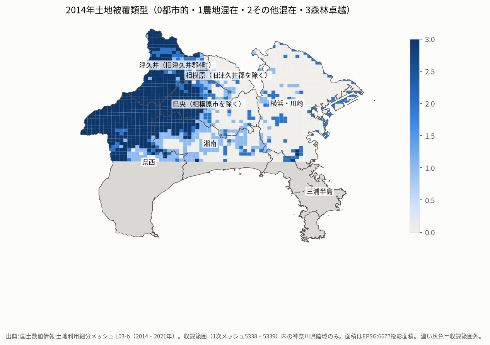
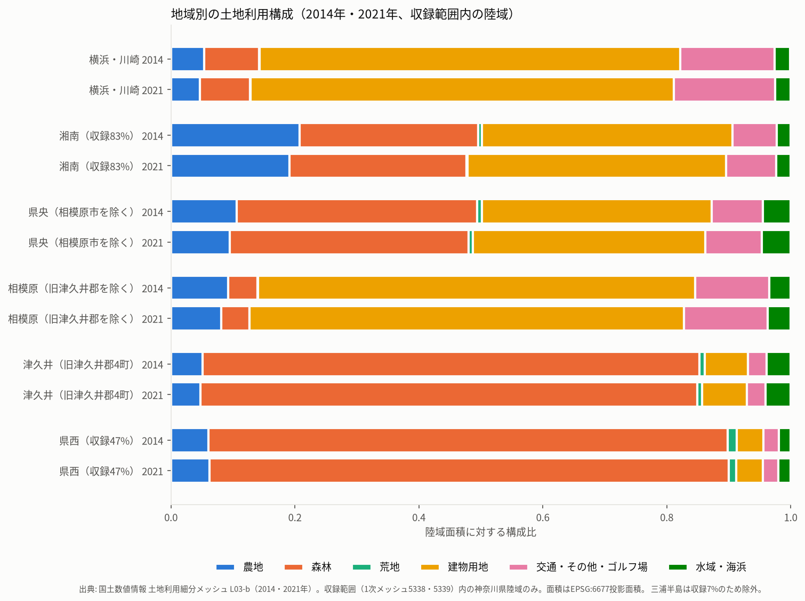
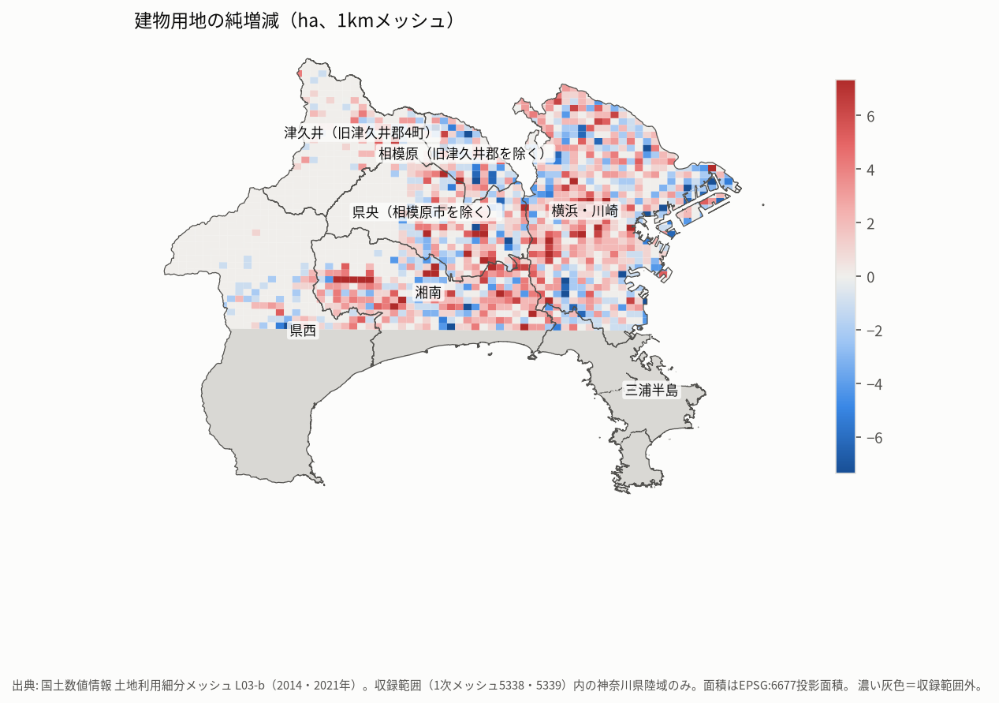
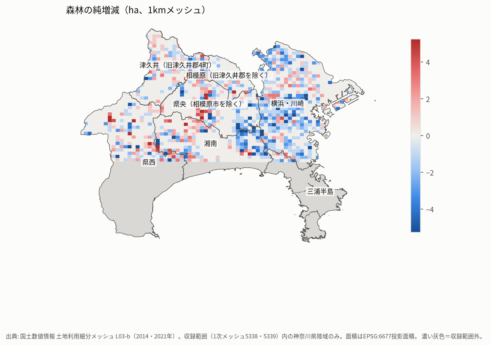
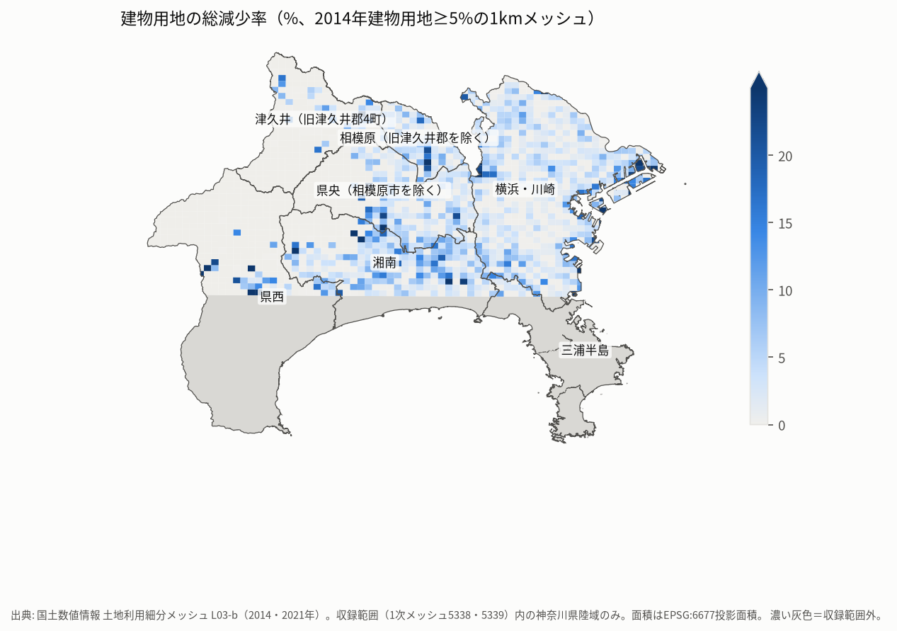
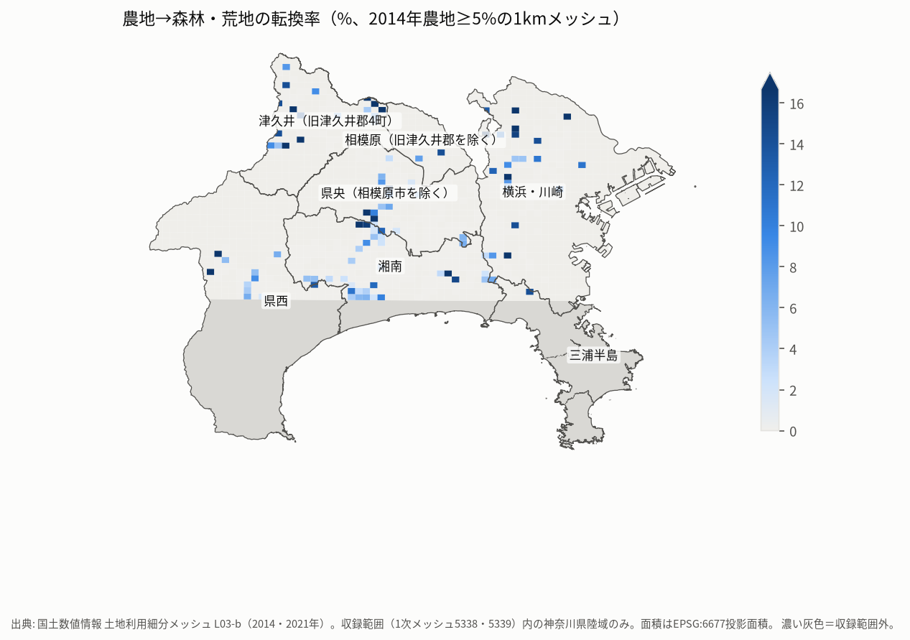
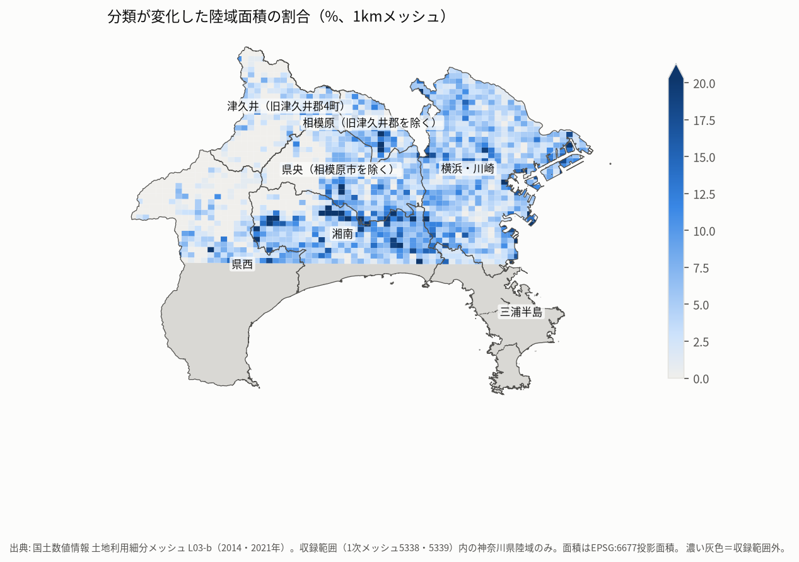
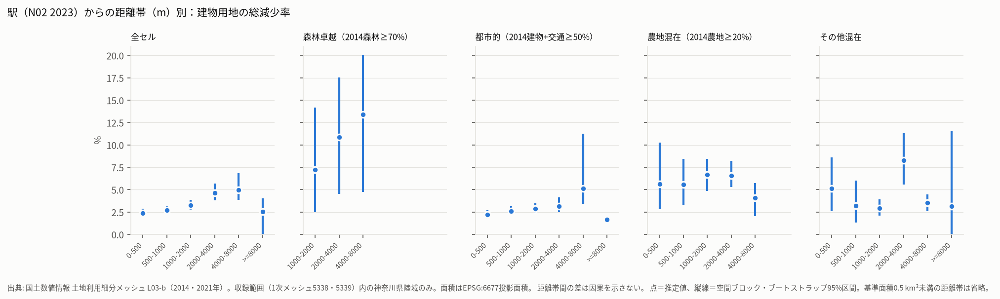

# Phase 1-C2 地域別分析・交通網・宗教施設・文化財

集計値はすべて、土地利用細分メッシュの収録範囲内にある神奈川県の陸域についてのもの。率の定義は`src/kanagawa_ruins/landuse_change/aggregate.py`の冒頭に記載している。CSV（Drive上 `csv/`）: `agg_region.csv`、`agg_municipality.csv`、`agg_mesh1km.csv`、`agg_mesh500m.csv`、`agg_landscape.csv`、`agg_region_landscape.csv`、`distance_rates_*.csv`、`distance_composition_*.csv`、`moran_mesh1km.csv`、`p32_*`、`osm_worship_context.csv`。GeoParquet（`geoparquet/`）: セル、1 km、500 m、市区町村の4種類。

## 1. 地域区分の定義

`config/phase1c2_regions.toml`で定義した。神奈川県の5つの地域政策圏（川崎・横浜、三浦半島、湘南、県央、県西）を基本とし、次の2点を変えている。

- 県央から相模原市を分けた。
- 相模原市緑区のうち、旧津久井郡4町（城山・津久井・相模湖・藤野）をCODHの2005-01-01時点の旧行政界で切り出した。

セルは重心で市区町村に割り当てた。

| 地域 | 構成 | 網羅率（面積） | 陸域 km² | 扱い |
|---|---|---:|---:|---|
| 横浜・川崎 | 横浜市18区・川崎市7区 | 98.9% | 573.7 | 比較可（金沢区は79%） |
| 三浦半島 | 横須賀・鎌倉・逗子・三浦・葉山 | **7.4%** | 15.3 | **比較から除外**（鎌倉市北部のみ） |
| 湘南 | 平塚・藤沢・茅ヶ崎・秦野・伊勢原・寒川・大磯・二宮 | 83.4% | 310.2 | 比較可（沿岸部の一部が欠ける） |
| 県央（相模原市を除く） | 厚木・大和・海老名・座間・綾瀬・愛川・清川 | 100% | 292.8 | 比較可 |
| 相模原（旧津久井郡を除く） | 中央区・南区・緑区の旧相模原市域 | 100% | 90.6 | 比較可 |
| 津久井（旧津久井郡4町） | CODH 2005の4町域 | 100% | 238.4 | 比較可 |
| 県西 | 小田原・南足柄・中井・大井・松田・山北・開成・箱根・真鶴・湯河原 | **46.7%** | 296.8 | 参考値（主に山北町・松田町。箱根・小田原は収録外） |

丹沢・箱根などの山間地域は、行政上の地域とは別に、2014年の土地被覆類型（森林卓越メッシュ）で扱った。箱根は収録外である。

## 2. 地域別の構成と変化

| 指標 | 横浜・川崎 | 湘南* | 県央 | 相模原 | 津久井 | 県西* |
|---|---:|---:|---:|---:|---:|---:|
| 農地（2014） | 5.4% | 20.7% | 10.6% | 9.2% | 5.1% | 6.1% |
| 森林（2014） | 8.8% | 28.9% | 38.8% | 4.8% | 80.2% | 83.8% |
| 建物用地（2014） | 67.8% | 40.4% | 37.1% | 70.6% | 6.9% | 4.3% |
| 農地の純変化率 | −13.1% | −7.7% | −10.4% | −11.9% | −6.5% | +2.2% |
| 農地の総減少率 | 18.2% | 12.0% | 13.1% | 16.6% | 9.3% | 4.7% |
| 農地→森林 | 1.6% | 0.8% | 1.3% | 0.4% | 2.4% | 0.8% |
| 農地→荒地 | 0.0% | 0.03% | 0.03% | 0.0% | 0.0% | 0.23% |
| 森林化率（非森林陸域→森林） | 0.47% | 0.99% | 0.85% | 0.46% | 3.86% | 3.93% |
| 建物用地の総減少率 | 2.85% | 3.62% | 3.06% | 3.69% | 3.30% | 7.20% |
| 建物用地→森林・荒地 | 0.28% | 0.28% | 0.32% | 0.23% | 1.78% | 2.29% |
| 建物用地の純変化率 | +0.76% | +3.04% | +1.19% | −0.57% | +4.25% | −0.25% |
| 分類が変化した陸域の割合 | 5.7% | 6.6% | 4.3% | 6.0% | 2.2% | 2.0% |
| 変化のうち単独セルの割合 | 84% | 80% | 83% | 80% | 83% | 81% |

\* 収録範囲が一部のみ。

面積（km²）:

| 地域 | 建物用地（2014） | 建物用地の総減少 | 建物用地の総増加 | 農地（2014） | 農地→森林・荒地 | 農地→建物用地 |
|---|---:|---:|---:|---:|---:|---:|
| 横浜・川崎 | 389.22 | 11.08 | 14.06 | 30.96 | 0.49 | 3.73 |
| 湘南* | 125.44 | 4.54 | 8.35 | 64.29 | 0.56 | 4.62 |
| 県央 | 108.47 | 3.32 | 4.61 | 30.99 | 0.40 | 2.50 |
| 相模原 | 63.92 | 2.36 | 1.99 | 8.34 | 0.03 | 0.91 |
| 津久井 | 16.52 | 0.55 | 1.25 | 12.17 | 0.29 | 0.70 |
| 県西* | 12.84 | 0.92 | 0.89 | 18.09 | 0.19 | 0.49 |

**観測された事実**: 都市部と県央では、農地の減少がもっとも大きな変化で、その転換先は主に建物用地とその他の用地である。津久井と県西（収録部分）は、変化の面積割合は小さいが、森林化率と建物用地→森林・荒地の率が横浜・川崎の4〜8倍程度ある。ただし、該当する遷移の面積は各0.2〜0.3 km²程度にすぎない。津久井では建物用地の総増加（1.25 km²）が総減少（0.55 km²）を上回る。

### 2.1 2014年土地被覆類型別

| 類型（1 kmメッシュ数／陸域km²） | 森林卓越（581／563.3） | 都市的（825／814.8） | 農地混在（235／241.9） | その他混在（245／197.7） |
|---|---:|---:|---:|---:|
| 農地の純変化率 | −4.3% | −14.5% | −5.4% | −8.9% |
| 農地→森林 | 4.4% | 0.9% | 0.9% | 2.3% |
| 森林化率 | 9.0% | 0.31% | 1.34% | 2.26% |
| 建物用地の総減少率 | 10.3% | 2.7% | 6.2% | 4.6% |
| 建物用地→森林・荒地 | 6.2% | 0.20% | 0.73% | 1.10% |
| 建物用地の純変化率 | −0.55% | +0.65% | +5.5% | +2.3% |
| 分類が変化した陸域の割合 | 1.05% | 5.4% | 8.6% | 6.5% |

森林卓越メッシュの建物用地は5.8 km²（陸域の1.0%）しかないため、率が大きく見える。建物用地の純変化は−0.55%で、減少の大半は新たな建物用地の判読で相殺されている。

### 2.2 市区町村（網羅率95%以上）

全市区町村の表は`agg_municipality.csv`にある（網羅率の列を含む）。目立った値:

- 建物用地の総減少率が高いのは山北町9.9%（基数3.8 km²）、清川村9.4%（同0.9 km²）、寒川町6.7%、川崎市川崎区6.4%。山北町と清川村は基数が小さく、川崎区と寒川町は大規模なまとまり（その他の用地への転換）を含む。
- 農地の純変化率がもっとも大きい減少は横浜市栄区−32%、川崎市宮前区−36%、川崎市多摩区−50%。いずれも農地の基数が1 km²未満である。
- 建物用地の純増率が高いのは秦野市+6.3%、横浜市保土ケ谷区+4.8%、清川村+4.7%。

## 3. 1 kmメッシュの分布と空間自己相関

| 図 | |
|---|---|
|  |  |
|  |  |
|  | |

Moran's I（1 kmメッシュ、陸域0.5 km²以上。queen近傍・行標準化・孤立メッシュは除外。999回の並べ替え検定、片側）:

| 変数 | 対象 | n | I | 期待値 | p |
|---|---|---:|---:|---:|---:|
| 建物用地の総減少率 | 2014建物用地≥5% | 1,192 | 0.139 | −0.001 | 0.001 |
| 農地の総減少率 | 2014農地≥5% | 635 | 0.223 | −0.002 | 0.001 |
| 農地→森林率 | 2014農地≥5% | 635 | 0.112 | −0.002 | 0.001 |
| 農地の純変化率 | 2014農地≥5% | 635 | 0.206 | −0.002 | 0.001 |
| 森林化率 | 全メッシュ | 1,435 | 0.397 | −0.001 | 0.001 |
| 変化した割合 | 全メッシュ | 1,740 | 0.379 | −0.001 | 0.001 |

すべての指標で正の空間自己相関がある（p=0.001は999回の並べ替えで得られる最小値）。そのため隣接するメッシュを独立な観測として扱う検定は不適切であり、以下の距離帯比較では空間ブロック・ブートストラップの区間を示す。自己相関は、実際の変化の空間的なまとまりのほか、2次メッシュ単位で異なる撮影日・判読作業単位によっても生じうる（2021年の撮影日は2次メッシュ単位）。

## 4. 交通網と土地利用

### 4.1 データ年次の違い

| データ | 年次 | 範囲 | 用途 |
|---|---|---|---|
| L03-b「道路」（0901）セル | 2014 | 収録範囲全体 | 2014年時点の幅の広い道路の代理指標（セル中心間の格子距離） |
| N02 鉄道区間・駅 | 2023 | 全国（県域＋20 kmで抽出） | 鉄道・駅からの距離 |
| OSM 道路 | 2026-10 | 津久井周辺の窓（139.12–139.25°E、35.51–35.62°N、内側1 km）のみ | 窓内での補助分析 |

OSM道路を2014年の道路状況として扱っていない。2014〜2023年の間に開業・廃止された鉄道区間はN02 2023に反映されている（2014年時点とは異なる）。「道路」セルは100 mセルの優占分類なので、細い道路は表れない。収録範囲の端では、範囲外により近い道路がありうるため、2.4%のセルを打ち切りとして除外した。

### 4.2 結果（率は%、括弧内は95%ブロック・ブートストラップ区間。基準面積0.5 km²未満の距離帯は省略）

**駅（N02 2023）からの距離 × 建物用地の総減少率**

| 距離帯 | 全セル | 都市的 | 森林卓越 |
|---|---|---|---|
| 0–500 m | 2.35 (1.94–2.85) | 2.23 (1.78–2.70) | — |
| 500–1000 m | 2.72 (2.30–3.21) | 2.61 (2.17–3.13) | — |
| 1–2 km | 3.23 (2.73–3.88) | 2.88 (2.38–3.48) | 7.21 (2.47–14.15) |
| 2–4 km | 4.65 (3.81–5.69) | 3.12 (2.45–4.11) | 10.85 (4.54–17.54) |
| 4–8 km | 4.97 (3.88–6.83) | 5.13 (3.40–11.22) | 13.40 (4.74–20.01) |
| ≥8 km | 2.52 (0–4.01) | — | — |

駅からの距離帯別の2014年構成比（全セル）を見ると、森林は0–500 mで5.0%、4–8 kmで76.7%、8 km以上で94.5%であり、距離帯によって土地被覆構成が大きく異なる。

**2014年道路セルからの距離 × 建物用地の総減少率**: 全セルでは0–200 mで3.32%、800–1600 mで3.22%、1600 m以上で5.04%（3.83–6.44）。都市的メッシュでは3.01、2.72、2.39、2.71、3.01%とほぼ一定。森林卓越メッシュの1600 m以上では12.08%（5.61–17.55）だが、基数は3.65 km²である。

**農地→森林・荒地の転換率**: 駅0–500 mで0.16%、4–8 kmで2.37%（1.00–4.13）。2014年道路セル1600 m以上で2.28%（1.02–4.10）。森林卓越メッシュでは、道路1600 m以上で5.63%（2.67–9.46）。

**鉄道からの距離**: 駅と同じ傾向（全セルの建物用地総減少率は0–500 mで2.43%、2–4 kmで4.81%。都市的メッシュは2.24〜3.26%）。

**OSM車道（2026、津久井周辺）**: 窓内の建物用地の基準面積は、0–100 mの距離帯で5.05 km²、100–200 mで0.05 km²だった。建物用地はほぼすべて車道から100 m以内にあるため、距離帯の比較はできない（ブロック数も6と少ない）。0–100 mの建物用地の総減少率は3.32%（2.17–4.45）。

### 4.3 読み方

- 全セルで見える「遠いほど建物用地の減少率が高い」傾向は、層別すると大幅に小さくなる。距離そのものの影響ではなく、遠方ほど森林卓越地の割合が高いという構成の違いで、大部分が説明されると考えられる。
- 都市的メッシュでは、駅から2–4 kmまで緩やかな上昇（2.2→3.1%）が残る。区間が一部重なり、判読差の影響もあるため、意味のある勾配とは結論しない。
- 森林卓越メッシュは率が高く、区間も広い。基数が1〜3 km²と小さく、境界の単独変化が多い（建物用地→森林の88%）。
- 相関から因果は推論しない。道路距離と傾斜・標高は強く関係すると予想されるが、DEMがないため分離できていない。

## 5. 文化財（P32）周辺の土地利用

- P32（県指定文化財、2014-01-31時点）336件のうち、代表点区分が1（敷地・建物）、2（地番）、9（緯度経度）の334件を使った。大字・丁目レベルの2件は除外した。
- 同一座標を1地点にまとめて215地点。そのうち、解析可能な範囲（収録範囲∩県域）の境界から500 m以上内側にある**108地点（164件）**を対象とした。地域別の内訳は横浜・川崎35、湘南30、県央21、県西10、津久井6、相模原3、三浦3。種別は有形文化財、天然記念物、史跡、有形民俗、名勝を含む。
- 半径250 mと500 mの円内に重心がある陸域セルを集計した（各地点の円は重なりうるので、セルが重複して数えられることがある）。比較対象として、各地点の地域の値の平均（地域で重み付け）と、各地点の2014年土地被覆類型の値の平均（類型で重み付け）を示す。

| 指標 | 250 m圏 | 500 m圏 | 地域重み付け基準 | 類型重み付け基準 |
|---|---:|---:|---:|---:|
| 農地（2014） | 9.4% | 11.1% | 10.8% | 12.4% |
| 森林（2014） | 27.0% | 26.7% | 31.6% | 22.4% |
| 建物用地（2014） | 53.4% | 49.7% | 44.7% | 50.5% |
| 農地の総減少率 | 16.9% | 13.1% | 13.4% | 15.2% |
| 農地→森林 | 3.2% | 2.6% | 1.3% | 1.5% |
| 森林化率 | 1.29% | 1.10% | 1.21% | 1.72% |
| 建物用地の総減少率 | 2.5% | 2.2% | 3.5% | 4.5% |
| 建物用地の純変化率 | +2.4% | +2.1% | +1.5% | +1.7% |
| 変化した割合 | 5.9% | 5.3% | 5.1% | 5.7% |

天然記念物を含む地点では、250 m圏の森林が42.0%（含まない地点は20.3%）。P32地点から鉄道までの距離の中央値は1.19 km、駅までは1.30 km。

**読み方**: P32地点の周辺は、同じ地域の平均より建物用地の割合が高く、森林の割合が低い。これは県指定文化財（社寺建造物など）が集落内にある傾向と整合する。250 m圏の農地は1.98 km²しかなく、農地→森林3.2%は約6セル分にすぎないため、基準値との差は誤差の範囲として扱う。P32は県指定に限られ、国指定・市町村指定・未指定の社寺を含まない。

## 6. OSMの宗教施設・historicと交通アクセス（津久井周辺のみ）

- OSMの宗教施設: 20の抽出レイヤーを統合し、18件の重複を除いて**21件**（神道15、仏教5、不明1。閉じたway 14件・node 7件）。すべて津久井周辺の窓の中にある。
- 旧町村（CODH 2005、point-in-polygon）: 津久井町9、藤野町5、相模湖町4、旧津久井郡外3。CODH 1955の津久井町域には9件。1955年と2005年の津久井町は同じ実体ID（`gci:14422A1968`）で、境界はほぼ同一（対称差約2,000 m²）である。
- 車道（OSM 2026）までの距離: 中央値21 m、最大247 m。窓内の全セルの中央値は208 mで、21件中20件が窓内セルの距離分布の下位35%以内にある。
- 250 m圏の構成: 森林54.2%、建物用地24.5%（窓全体では森林80.9%、建物用地5.0%）。2014→2021年の建物用地の純変化は+15.5%（基数0.88 km²）。
- OSMのhistoric 39件の内訳: memorial 21、wayside_shrine 14、monument 2、archaeological_site 1、その他1。

**読み方**: 確認できたOSMの宗教施設は道路沿い・集落内に分布している。しかし、OSMは主に道路沿いの建物が登録されやすく、網羅的な神社台帳ではない。山間で道路から離れた社寺が登録されていないことは、その社寺がないことを意味しない。21件では統計的な比較は成り立たない。

## 7. 1976年との比較

1976年はTokyo Datumのため、空間的な対応付けを行っていない（[歴史地理学的解釈 §2](phase1c2_historical_interpretation.md#2-1976年の属性集計空間比較なし)）。
