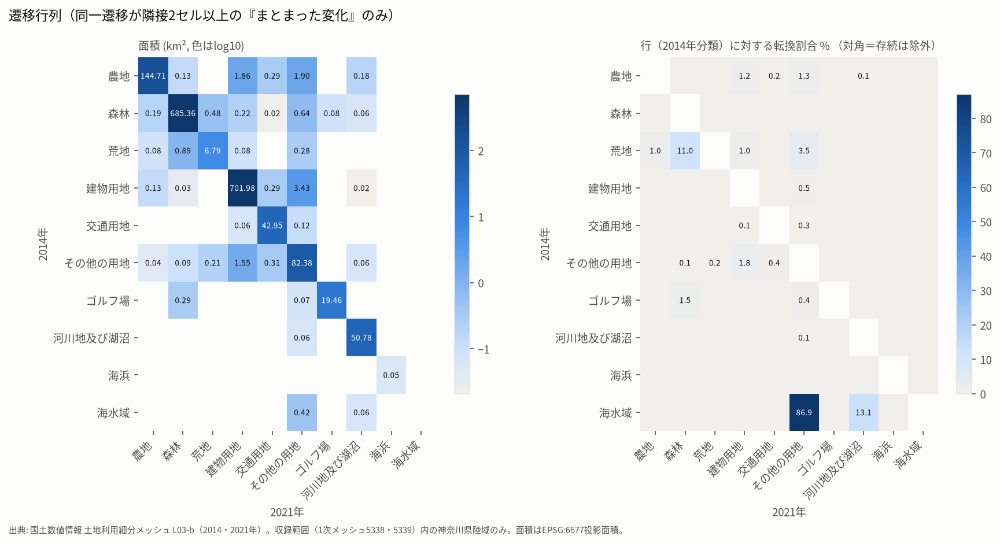

# Phase 1-C2 土地利用遷移行列（2014→2021年）

対象: 土地利用細分メッシュ L03-b（1次メッシュ5338・5339）のうち、N03（2026年）の神奈川県域に重心があり、両年とも海水域であるセルを除いた陸域 173,308セル・1,817.7 km²。県土の75.3%（[データの制約 §1](phase1c2_data_limitations.md#1-収録範囲)）。

CSV（Drive上 `processed/phase1c/claude/phase1c2-claude-0.1.0/csv/`）:
`transition_group_area_km2.csv`、`transition_fine_area_km2.csv`、`transition_fine_cells.csv`、`transition_group_patch_only_km2.csv`、`transition_group_gls.csv`、`transition_fine_gls.csv`、`transition_group_by_region_long.csv`、`transition_context_breakdown.csv`。

## 1. 位置の対応付け

- 2014年（元JGD2000）と2021年（元JGD2011）は、同じJIS X 0410の10桁メッシュコード（3次メッシュ＋南西起点の行・列）で結合した。コード集合は完全に一致した（各1,270,000）。
- 同一コードのセル重心の差は最大1.85×10⁻⁵ m、メッシュコードから復号したセル中心との差は最大1.0×10⁻⁴ m。異なる場所のセルを比較していないことを全セルで確認した。
- JGD2000とJGD2011の地殻変動補正による地上での差（数cm程度）は、100 mセルに比べて無視できる。
- 1976年（Tokyo Datum）は、同じコードでも地上の位置が約400 mずれるため、遷移行列には含めていない。

## 2. 分類コードの整合性

| 年次 | 公式コード表 | 観測コード数 | 未知コード | 備考 |
|---|---|---:|---|---|
| 2014 | LandUseCd-09（平成21・26・28年度、令和3年共通） | 12 | なし | 0300・0400・0800・1200・1300は「未設定」 |
| 2021 | LandUseCd-09 | 12 | なし | 2014年と同じ表・同じ定義文 |
| 1976 | LandUseCd-77 | 15 | なし | 建物用地A/B、幹線交通用地、ゴルフ場は「その他の用地」に含む |

コード表と定義文は同一だが、**判読の方法と使用画像が年次で異なる**。公式の製品情報では、平成26年度はSPOT・RapidEye画像と電子国土基本図・電子地形図25000、令和3年度はSPOT画像と電子国土基本図・電子地形図（タイル）を使用している。「2021年度（令和3年度）ではこれまでの衛星画像よりも高解像度な衛星画像を用いたことにより」2016年度以前と多くの判読が異なり、複数年の重ね合わせ解析では判読方法の違いを考慮するよう注意書きがある（[KsjTmplt-L03-b-2021](https://nlftp.mlit.go.jp/ksj/gml/datalist/KsjTmplt-L03-b-2021.html)、2026-10-11確認）。荒地の定義には「旧土地利用データが荒地であるところ」という過去データへの依存も含まれる。

2021年の`L03b_003`（衛星写真撮影年月日）は2次メッシュ単位で、2020-05-30〜2020-12-18の範囲だった。2014年版にはこの属性がない。

## 3. 分析用グループの遷移行列（km²）

| 2014＼2021 | 農地 | 森林 | 荒地 | 建物用地 | 交通用地 | その他 | ゴルフ場 | 河川湖沼 | 海浜 | 海水域 | 計 |
|---|---|---|---|---|---|---|---|---|---|---|---|
| 農地 | 144.71 | 1.92 | 0.07 | 12.97 | 1.09 | 4.19 | 0.02 | 0.55 |  |  | 165.52 |
| 森林 | 2.72 | 685.36 | 1.30 | 7.58 | 0.54 | 2.82 | 0.74 | 1.13 |  |  | 702.19 |
| 荒地 | 0.57 | 2.51 | 6.79 | 0.49 | 0.08 | 0.65 |  | 0.18 |  |  | 11.27 |
| 建物用地 | 3.31 | 2.53 | 0.05 | 701.98 | 4.31 | 11.96 | 0.03 | 0.76 |  | 0.03 | 724.95 |
| 交通用地 | 0.12 | 0.23 |  | 2.59 | 42.95 | 0.67 |  | 0.09 |  |  | 46.65 |
| その他 | 0.39 | 1.23 | 0.25 | 7.34 | 1.00 | 82.38 | 0.02 | 0.34 |  | 0.03 | 92.98 |
| ゴルフ場 | 0.01 | 1.61 | 0.01 | 0.03 |  | 0.15 | 19.46 | 0.02 |  |  | 21.29 |
| 河川湖沼 | 0.12 | 0.36 | 0.03 | 0.36 | 0.22 | 0.26 | 0.01 | 50.78 |  |  | 52.13 |
| 海浜 |  |  |  |  |  |  |  |  | 0.05 |  | 0.05 |
| 海水域 |  |  |  | 0.04 |  | 0.56 |  | 0.07 |  |  | 0.67 |

（空欄は0。「計」は2014年の面積。海水域→その他の用地0.56 km²は埋立・港湾の可能性がある。）

## 4. 細分類の遷移行列

### 面積（km²）

| 2014＼2021 | 田 | 他農用地 | 森林 | 荒地 | 建物 | 道路 | 鉄道 | その他 | ゴルフ | 河川湖沼 | 海浜 | 海水域 | 計 |
|---|---|---|---|---|---|---|---|---|---|---|---|---|---|
| 田 | 44.52 | 0.18 | 0.34 | 0.04 | 2.12 | 0.34 | 0.03 | 1.63 |  | 0.43 |  |  | 49.62 |
| 他農用地 | 0.10 | 99.91 | 1.58 | 0.03 | 10.85 | 0.70 | 0.02 | 2.56 | 0.02 | 0.12 |  |  | 115.90 |
| 森林 | 0.39 | 2.33 | 685.36 | 1.30 | 7.58 | 0.50 | 0.03 | 2.82 | 0.74 | 1.13 |  |  | 702.19 |
| 荒地 | 0.05 | 0.51 | 2.51 | 6.79 | 0.49 | 0.07 | 0.01 | 0.65 |  | 0.18 |  |  | 11.27 |
| 建物 | 0.84 | 2.47 | 2.53 | 0.05 | 701.98 | 3.93 | 0.38 | 11.96 | 0.03 | 0.76 |  | 0.03 | 724.95 |
| 道路 |  | 0.04 | 0.20 |  | 1.73 | 29.04 | 0.03 | 0.37 |  | 0.05 |  |  | 31.47 |
| 鉄道 | 0.04 | 0.03 | 0.03 |  | 0.86 | 0.06 | 13.81 | 0.30 |  | 0.04 |  |  | 15.19 |
| その他 | 0.03 | 0.36 | 1.23 | 0.25 | 7.34 | 1.00 |  | 82.38 | 0.02 | 0.34 |  | 0.03 | 92.98 |
| ゴルフ | 0.01 |  | 1.61 | 0.01 | 0.03 |  |  | 0.15 | 19.46 | 0.02 |  |  | 21.29 |
| 河川湖沼 | 0.05 | 0.06 | 0.36 | 0.03 | 0.36 | 0.22 |  | 0.26 | 0.01 | 50.78 |  |  | 52.13 |
| 海浜 |  |  |  |  |  |  |  |  |  |  | 0.05 |  | 0.05 |
| 海水域 |  |  |  |  | 0.04 |  |  | 0.56 |  | 0.07 |  |  | 0.67 |

### セル数（参考。面積の代わりには使わない）

| 2014＼2021 | 田 | 他農用地 | 森林 | 荒地 | 建物 | 道路 | 鉄道 | その他 | ゴルフ | 河川湖沼 | 海浜 | 海水域 | 計 |
|---|---|---|---|---|---|---|---|---|---|---|---|---|---|
| 田 | 4242 | 17 | 32 | 4 | 202 | 32 | 3 | 155 |  | 41 |  |  | 4728 |
| 他農用地 | 10 | 9523 | 151 | 3 | 1034 | 67 | 2 | 244 | 2 | 11 |  |  | 11047 |
| 森林 | 37 | 222 | 65347 | 124 | 723 | 48 | 3 | 269 | 71 | 108 |  |  | 66952 |
| 荒地 | 5 | 49 | 239 | 647 | 47 | 7 | 1 | 62 |  | 17 |  |  | 1074 |
| 建物 | 80 | 235 | 241 | 5 | 66933 | 375 | 36 | 1140 | 3 | 72 |  | 3 | 69123 |
| 道路 |  | 4 | 19 |  | 165 | 2769 | 3 | 35 |  | 5 |  |  | 3000 |
| 鉄道 | 4 | 3 | 3 |  | 82 | 6 | 1317 | 29 |  | 4 |  |  | 1448 |
| その他 | 3 | 34 | 117 | 24 | 700 | 95 |  | 7855 | 2 | 32 |  | 3 | 8865 |
| ゴルフ | 1 |  | 154 | 1 | 3 |  |  | 14 | 1855 | 2 |  |  | 2030 |
| 河川湖沼 | 5 | 6 | 34 | 3 | 34 | 21 |  | 25 | 1 | 4843 |  |  | 4972 |
| 海浜 |  |  |  |  |  |  |  |  |  |  | 5 |  | 5 |
| 海水域 |  |  |  |  | 4 |  |  | 53 |  | 7 |  |  | 64 |

セル面積は緯度により約10,420〜10,510 m²の範囲で変わる。そのため面積はセルごとの投影面積の合計で計算した。

## 5. 総増加・総減少・swap（細分類、km²）

| コード | 2014 | 2021 | 総減少 | 総増加 | 純変化 | 純変化率 | swap | swap/総変化 |
|---|---:|---:|---:|---:|---:|---:|---:|---:|
| 田 | 49.62 | 46.04 | 5.10 | 1.52 | −3.58 | −7.2% | 3.04 | 0.46 |
| その他の農用地 | 115.90 | 105.89 | 15.99 | 5.98 | −10.01 | −8.6% | 11.96 | 0.55 |
| 森林 | 702.19 | 695.74 | 16.83 | 10.38 | −6.45 | −0.9% | 20.77 | 0.76 |
| 荒地 | 11.27 | 8.51 | 4.48 | 1.72 | −2.76 | −24.5% | 3.44 | 0.55 |
| 建物用地 | 724.95 | 733.38 | 22.97 | 31.41 | +8.43 | +1.2% | 45.94 | 0.84 |
| 道路 | 31.47 | 35.87 | 2.42 | 6.83 | +4.41 | +14.0% | 4.85 | 0.52 |
| 鉄道 | 15.19 | 14.32 | 1.37 | 0.50 | −0.87 | −5.7% | 1.01 | 0.54 |
| その他の用地 | 92.98 | 103.64 | 10.59 | 21.25 | +10.66 | +11.5% | 21.19 | 0.67 |
| ゴルフ場 | 21.29 | 20.29 | 1.84 | 0.83 | −1.01 | −4.7% | 1.66 | 0.62 |
| 河川地及び湖沼 | 52.13 | 53.92 | 1.35 | 3.14 | +1.78 | +3.4% | 2.71 | 0.60 |

建物用地は、変化量54.4 km²の84%が他所での逆向きの変化と相殺されるswapだった。森林も76%がswapである。このように相殺が大きいのは、分類境界の再配分や判読ノイズで典型的に生じるパターンである。ただし、建替え・移転など実際の入れ替わりでも生じうる。

## 6. 見かけの変化の区別（近傍条件）

各変化セルを8近傍で分類した（`transition.change_context`）。

| 区分 | 定義 | 変化面積に占める割合 |
|---|---|---:|
| patch | 同じ遷移（グループ単位）の隣接セルが2以上 | 17.6% |
| isolated_boundary | 単独の変化で、変化先の分類が2014年に既に隣接していた | 66.9% |
| isolated_interior | 単独の変化で、変化先の分類が2014年に隣接していなかった | 15.4% |

面積の大きい遷移の内訳:

| 2014 | 2021 | 面積 km² | patch | 境界単独 | 内部単独 |
|---|---|---:|---:|---:|---:|
| 農地 | 建物用地 | 12.97 | 14% | 82% | 4% |
| 建物用地 | その他 | 11.96 | 29% | 47% | 25% |
| 森林 | 建物用地 | 7.58 | 3% | 93% | 4% |
| その他 | 建物用地 | 7.34 | 21% | 76% | 3% |
| 建物用地 | 交通用地 | 4.31 | 7% | 32% | 61% |
| 農地 | その他 | 4.19 | 45% | 25% | 30% |
| 建物用地 | 農地 | 3.31 | 4% | 90% | 6% |
| 森林 | その他 | 2.82 | 23% | 48% | 29% |
| 森林 | 農地 | 2.72 | 7% | 86% | 7% |
| 交通用地 | 建物用地 | 2.59 | 2% | 97% | 1% |
| 建物用地 | 森林 | 2.53 | 1% | 88% | 11% |
| 荒地 | 森林 | 2.51 | 36% | 61% | 4% |
| 農地 | 森林 | 1.92 | 7% | 85% | 9% |
| ゴルフ場 | 森林 | 1.61 | 18% | 73% | 9% |
| 森林 | 荒地 | 1.30 | 37% | 31% | 31% |

解釈上の目安（判定ではない）:
- **まとまった変化（patch）の割合が比較的高い**: 農地→その他の用地（45%）、森林→荒地（37%）、荒地→森林（36%）、建物用地→その他の用地（29%）。造成・伐採・植生回復など、面的な実際の変化と整合する。
- **境界の単独変化がほとんど**: 森林↔建物用地、建物用地↔農地、交通用地→建物用地（97%）。100 mセル内の優占分類が入れ替わったか、高解像度画像で家屋・道路の検出が変わったことと整合する。
- **内部の単独変化が多い**: 建物用地→交通用地（61%）。市街地内で道路が新たに面として判読されたことと整合する。

まとまった変化だけを残した遷移行列（隣接条件を満たさない変化を除外したもの）:

この行列では、建物用地→森林が0.03 km²、農地→森林が0.13 km²、農地→建物用地が1.86 km²、建物用地→その他の用地が3.43 km²になる。

## 7. 地域別遷移

地域別の遷移行列は`transition_group_by_region_long.csv`にある（[地域別分析](phase1c2_regional_analysis.md)）。

## 8. 制約

- 2時点の比較であり、変化の時期や途中の経過は分からない。
- 100 mセルの優占分類なので、セル内の小規模な変化は表れず、優占分類が入れ替わると「全面的な変化」に見える。
- 近傍条件はノイズの目安であり、真偽を判定するものではない。単独セルの変化にも実際の変化は含まれ、patchの中にも判読差による変化は含まれうる。
